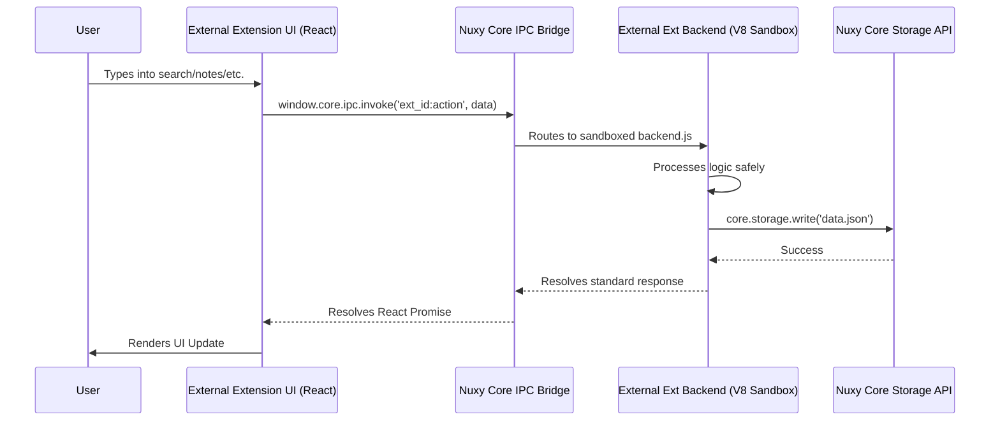

# 03 - Data Flow

## 1. Unidirectional Data across Boundaries

Because Nuxy is an Empty Shell acting as a router, the data flow occurs between the user's downloaded React UI (running in the Chromium Renderer) and the user's downloaded Backend Node.js code (running in the V8 Sandbox). The Nuxy kernel only acts as the bridge.

## 2. Real-Time Event Streams
For extensions that monitor system states (e.g., a Clipboard extension or a CPU monitor extension), the flow is reversed using a Publisher-Subscriber pattern.

1. **Sandboxed Backend Emits**: The backend uses the injected `core.ipc.broadcast('ext_id:event', payload)`.
2. **Nuxy Core Routes**: The core intercepts this and sends it across the Context Bridge to the Chromium window.
3. **Extension UI Listens**: The extension's React component, which mounted a `useEffect` hook listening to `window.core.ipc.on`, receives the payload and updates its internal state.

---

**Next Step:** [Modules](./04-modules.md) | **Previous:** [Architecture](./02-architecture.md)
