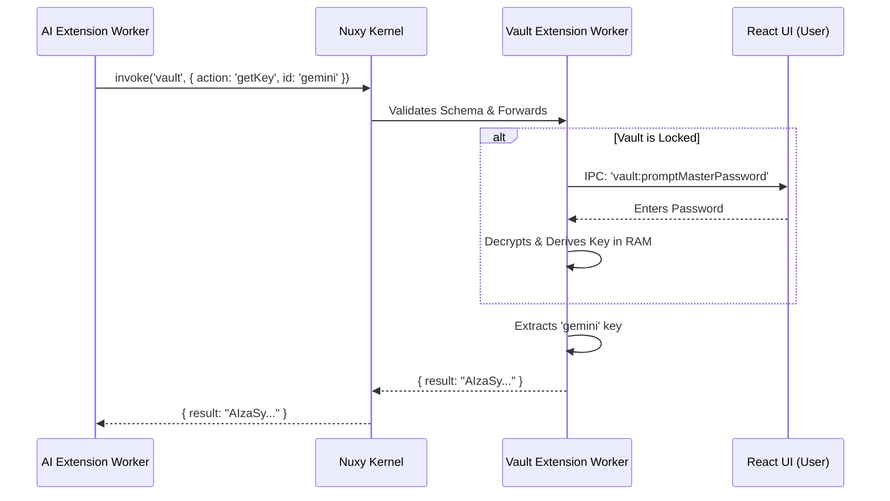

# 08 - Authentication & Cryptography

## 1. Local-Only Zero Trust
Nuxy contains no centralized cloud authentication, OAuth layers, or JWT tokens. User identity and security rely entirely on local cryptographic implementations, specifically within the **Password Vault Extension**.

## 2. Vault Extension Security Architecture

Because the Vault is just an extension like any other (`com.nuxy.vault`), its power comes from the Nuxy Core's strict isolation rules. The Vault is a `Tool` extension (`callable: true`).

### 2.1 The Cryptographic Engine
The Vault Worker Thread utilizes Node.js' native `crypto` library.
- **KDF**: `scryptSync` (Memory hardness).
- **Cipher**: `aes-256-gcm` (Confidentiality + Authenticity).

### 2.2 Cross-Extension Key Retrieval (The AI Use Case)
If the AI Orchestrator extension needs an API key (e.g., Gemini) to function, it *does not* ask the user directly. It asks the Vault via the Nuxy Message Broker.

### 2.3 Strict Memory Handling
- **No Disk Storage of Passwords**: The Master Password or the derived AES key is *never* written to disk by the Vault extension.
- **Volatile Storage**: The derived AES key resides in a Node.js closure variable inside the Vault's Worker thread. If the app quits, the key is destroyed.
- **Auto-Locking**: The Vault implements a `setTimeout` mechanism. If no vault activity occurs for 15 minutes, the RAM key variable is set to `null`.
