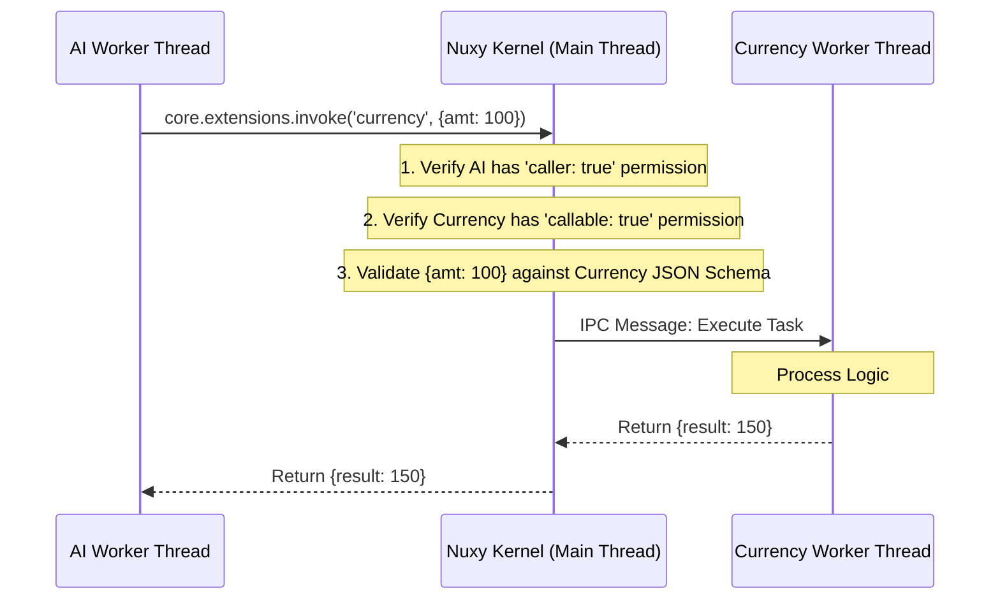

# 10 - Security & Strict Isolation

## 1. The Danger of Untrusted Code

Nuxy executes third-party extensions downloaded from the internet. If an extension contains malware, or if an AI Orchestrator is tricked via prompt injection to exploit another module, the system must remain impenetrable.

A simple Node.js `vm` sandbox is **not** a security mechanism. To achieve true Gnome Extensions-style plug-and-play without risking the host OS, Nuxy relies on **Hardware-Level Thread Isolation** and **Chroot File Boundaries**.

## 2. Execution Isolation (Web Workers)

Modules **do not** run in the main Node.js process. When the Nuxy Kernel boots an extension, it spawns a dedicated Node.js `Worker` thread (or utilizes the `isolated-vm` native package).

### 2.1 The Worker Boundary

1. **No Memory Sharing**: The AI Extension and the Currency Extension run in completely separate V8 Isolates/Threads. They physically cannot access each other's variables, prototypes, or memory space.
2. **No Native `require`**: The Worker thread is stripped of the ability to `require('fs')` or `require('child_process')`.
3. **MessagePort Communication**: The only way the extension communicates with the outside world is via a serialized `MessagePort` connected directly to the Nuxy Kernel.

## 3. Storage Isolation (Chroot Jails)

If a module attempts to read files, it must use the injected `core.storage` API. This API is actually an IPC wrapper that asks the Kernel to perform the I/O.

The Kernel enforces a strict virtual filesystem jail (similar to `chroot`):

- When `com.nuxy.notes` requests `core.storage.read('secret.txt')`, the Kernel translates this to `~/.nuxy/data/com.nuxy.notes/secret.txt`.
- If a malicious module requests `core.storage.read('../com.nuxy.vault/passwords.json')`, the Kernel detects the path traversal attempt via `path.relative` and rejects the request.

Extension frontend assets are served via `nuxy-ext://<manifest.id>/…`. The protocol handler resolves the manifest id to an on-disk folder and rejects any path that escapes that folder.

All user data lives under `~/.nuxy/` (config, extensions, themes, data). Legacy `~/.config/nuxy/data/` is migrated automatically on first access.

## 4. Cross-Module Invocation Security

When an Orchestrator (AI) needs to call a Tool (Currency), they **never interact directly**.

By routing all cross-module calls through the **Kernel Message Broker**:

1. Modules remain completely blind to each other's existence (other than knowing their public schema).
2. The Kernel acts as a strict firewall. If the AI hallucinates bad data, the Kernel rejects it before the Currency thread even sees the request.

## 5. Frontend UI Isolation (iframes / WebViews)

If extensions are highly untrusted, their React UI components can be rendered inside `<webview>` tags or Sandboxed IFrames rather than directly in the main DOM. This prevents a malicious extension from reading the DOM of the Password Vault extension via `document.querySelector`.

Nuxy enforces `contextIsolation: true` in Electron, and blocks external network requests via a strict Content Security Policy (CSP).

## 6. Dynamic Permission Prompts (User Consent)

Even with strict Worker isolation, if an extension asks the Kernel to read the clipboard (and it declared the `clipboard` permission in its manifest), the Kernel does not blindly trust it.

Nuxy implements an **OS-Style Permission Prompt**:

1. Extension A's Worker thread calls `core.clipboard.readText()`.
2. The Kernel pauses the execution of the Worker thread (via Atomics or asynchronous blocking).
3. The Kernel sends a message to the React UI: _"Extension A wants to read your clipboard."_
4. The user clicks **[Allow]** or **[Deny]**.
5. The Kernel resumes the Worker thread, either returning the clipboard text or throwing an `UnauthorizedError`.

This ensures the user is in absolute control of their privacy at all times, making stealthy data exfiltration practically impossible.

---

## Related Documents

| Topic                                    | Document                                                     | Notes                                                                   |
| ---------------------------------------- | ------------------------------------------------------------ | ----------------------------------------------------------------------- |
| Extension access and permission status   | [21-extension-access.md](./21-extension-access.md)           | Implemented vs planned permissions, clipboard consent status            |
| Plugin system and isolation loading      | [15-modular-plugin-system.md](./15-modular-plugin-system.md) | Thread spawning and CoreContext proxy detail                            |
| Known security gaps and remediation plan | [pain-points-plan.md](./pain-points-plan.md)                 | P4 (capabilities), P5 (clipboard), P6 (IPC allowlist), P7 (sandbox gap) |
| Web Components isolation (Shadow DOM)    | [architecture/lit-renderer-composition.md](./architecture/lit-renderer-composition.md) | Composition API, tool host, manifest slot claims                        |
