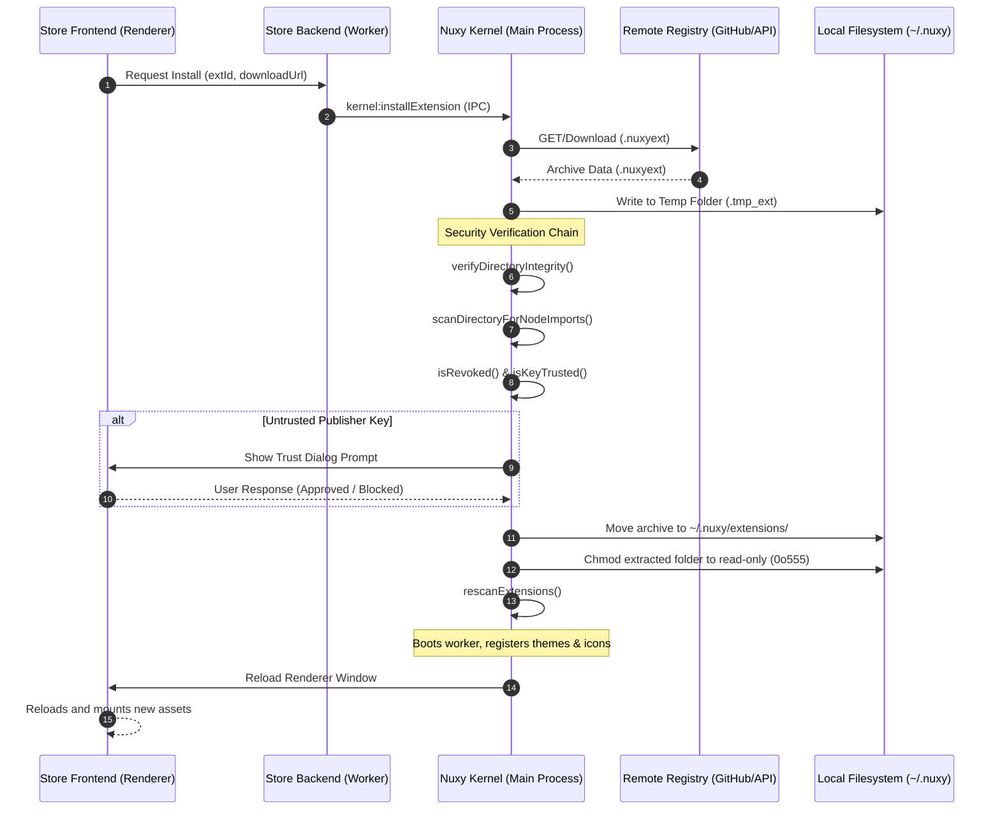

# Nuxy Store Extension Design & Implementation Plan

This document describes the architecture, data flow, security model, and implementation details for the **Nuxy Store** (`com.nuxy.store`), which enables users to browse, install, update, and uninstall third-party extensions, themes, and icon packs directly from Nuxy.

---

## 1. Architectural Changes

To maintain secure, sandbox-compliant execution, all file writes and download operations are delegated to the **Electron Main Process (Kernel)**. The store extension itself runs inside an isolated worker with limited privileges.

### Affected Modules & Files

#### [register.ts](file:///home/xava/Documents/nuxy/src/electron/ipc/register.ts) & [validate.ts](file:///home/xava/Documents/nuxy/src/electron/ipc/validate.ts)
- Registered new kernel-level IPC channels under `id === 'kernel'`:
  - `kernel:listInstalledExtensions`: Returns list of all installed extensions, including disabled ones.
  - `kernel:installExtension`: Downloads a `.nuxyext` archive from a given URL, verifies signature/sandbox integrity, saves it to `~/.nuxy/extensions`, and invokes rescan.
  - `kernel:uninstallExtension`: Deletes an extension's folder/archive from the extensions directory and unloads it.

#### [register.test.ts](file:///home/xava/Documents/nuxy/src/electron/ipc/register.test.ts) & [validate.test.ts](file:///home/xava/Documents/nuxy/src/electron/ipc/validate.test.ts)
- Added comprehensive unit tests validating IPC parameter validation, security restrictions (e.g., denying uninstallation of bootstrap/system extensions), and successful install/uninstall calls.

---

## 2. Store Extension Layout

The store is implemented as a standard `tool` extension placed under `extensions/store/`:

```
extensions/store/
├── manifest.json      # Requesting network, storage permissions
├── settings.json      # Customizable registryUrl
├── types.ts           # Registry schemas and lists
├── backend.ts         # Worker backend (fetching catalog, mapping versions)
└── frontend.tsx       # Dual-pane keyboard-navigable Store UI
```

---

## 3. Operational Logic & Data Flow

### 1. Catalog Browsing & Version Auditing
- When the Store UI is activated, the Frontend requests `getExtensions` from the Store Backend.
- The Backend reads the `registryUrl` setting (defaulting to a central GitHub JSON index) and fetches the index via `fetch()`.
- The Backend invokes `kernel:listInstalledExtensions` and merges the remote catalog with local installations to compute status:
  - **Not Installed**: Shows "Install".
  - **Installed & Up-to-Date**: Shows "Uninstall".
  - **Installed & Update Available**: Shows "Update" and "Uninstall".

### 2. Installation Sequence
- User triggers "Install" or "Update" on an extension:
  1. Frontend -> Store Backend -> Kernel (`kernel:installExtension` IPC).
  2. Kernel downloads the `.nuxyext` archive into a temporary folder.
  3. Kernel executes the **Security Verification Chain**.
  4. If verified, the archive is moved to `~/.nuxy/extensions/` and old versions are overwritten.
  5. Kernel triggers `rescanExtensions()`, which extracts the archive, hardens permissions, and boots worker processes.
  6. The renderer window reloads, mounting the new frontend assets.

---

## 4. Security Protocols

Installing external code on a desktop environment poses significant security risks. Nuxy mitigates these risks using a **7-stage Security Chain**:

```
Download -> Signature Check (signature.json) -> Revocation list scan -> Publisher Trust verification -> Static import scan -> Read-only directory hardening
```

1. **Sandbox Isolation**:
   - The Store extension runs as an unprivileged worker thread. It is forbidden from writing files directly to `~/.nuxy/extensions/` or accessing Node's `child_process`/`fs` directly. All install writes are audited and executed by the Kernel.
2. **Cryptographic Signature Verification**:
   - The Kernel validates `signature.json` within the package. The folder's SHA256 integrity hash is computed and verified against the publisher's RSA public key signature.
3. **Revocation & Blacklist Lookups**:
   - The Kernel matches extension IDs and publisher key hashes against a remote revocation list (`revoked-extensions.json`) on start and during installation.
4. **Publisher Key Trust Handshake**:
   - If the publisher's key is unrecognized, a native Electron confirmation dialog prompts the user: "Trust & Install" or "Block". Approved keys are saved to `trusted-keys.json`.
5. **Static Import Scanning**:
   - Before extraction, the Kernel parses all `.js`, `.ts` and script files in the package. Any direct imports of Node built-ins (`fs`, `child_process`, etc.) are caught and block installation, ensuring workers rely strictly on the sandboxed `CoreContext`.
6. **Read-Only Permissions Enforcement**:
   - Once extracted into `~/.nuxy/extracted/`, the directories are recursively set to `0o555` (read-only/execute). Extensions cannot modify their own code or touch other extensions.
7. **Permission Audit UI**:
   - The Store frontend displays requested permissions (e.g. `network`, `clipboard`) with colored risk badges. Highly sensitive permissions (`shell`, `fs`) display prominent danger warnings.

---

## 5. Sequence Diagram



---

## 6. Verification & Test Suite

### Automated Tests
- **Preload/IPC Validation Tests (`validate.test.ts`)**: Confirms validation rules block unknown channels and accept valid parameters.
- **Kernel IPC Tests (`register.test.ts`)**: Mocks network fetches and file actions to test successful download/write routines and verification triggers.
- **Store Backend Tests (`backend.test.ts`)**: Simulates remote JSON registries and installed arrays to verify accurate catalog merging and update check outputs.

All tests compile cleanly (`tsc --noEmit`) and pass within the Vitest suite:
```bash
pnpm -C src test -- run
# Test Files  41 passed (41)
#      Tests  705 passed (705)
```

---

## Related Documents

| Topic | Document | Notes |
| ----- | -------- | ----- |
| Plugin system and extension isolation | [15-modular-plugin-system.md](./15-modular-plugin-system.md) | Worker thread model that the store installs into |
| Extension access and permissions | [21-extension-access.md](./21-extension-access.md) | `kernel:installExtension` channel and permission gate |
| Frontend rendering and UI kit | [17-frontend-extensions.md](./17-frontend-extensions.md) | How the store's dual-pane frontend mounts |
