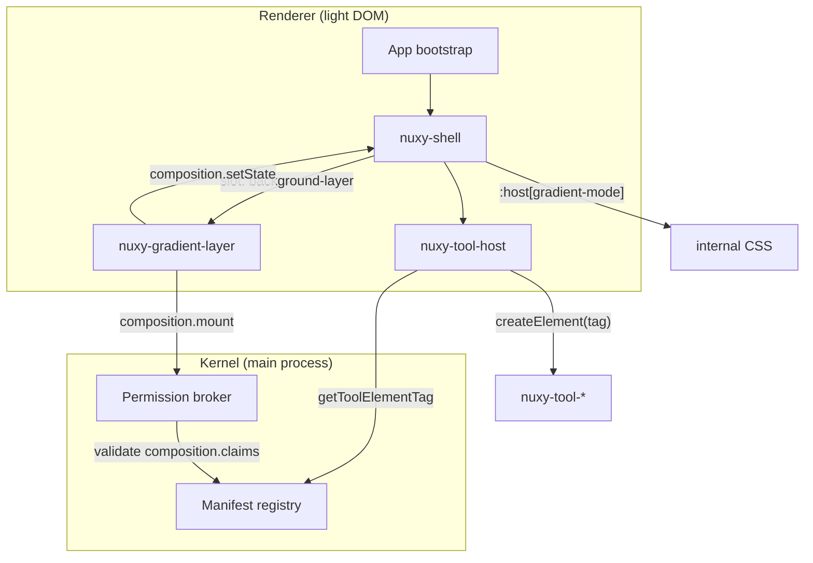

# Web Components Renderer Architecture — Composition & Tool Host

Secure, explicit contracts for cross-extension UI integration in the vanilla Web Components renderer.

**Related:** [React → Web Components migration](../react-to-lit-migration.md) · [Security model](../10-security.md) · [Extension access](../21-extension-access.md)

---

## 1. Problem statement

Two patterns in the current React renderer rely on **implicit DOM coupling**. Both break under Shadow DOM and are unsafe for a third-party extension ecosystem.

### 1.1 Cross-extension DOM injection (gradient → shell)

Today, `com.nuxy.gradient` reaches into the shell by querying the light DOM:

```ts
const container = document.querySelector('.nuxy-shell-container')
container.prepend(canvas)
container.classList.add('nuxy-shell-container--gradient-active')
```

Shell tries to help by dispatching `nuxy-shell-mounted` with a raw `container` ref. That ref is useless once `<nuxy-shell>` owns a shadow root — and third-party extensions must never receive shell internals anyway.

**Security issue:** Any extension can `document.querySelector('.nuxy-shell-container')` and mutate shell DOM or read layout state.

### 1.2 Dynamic tool rendering (shell → tool)

Today, shell dynamically imports a React component and renders it inside its own tree:

```ts
dynamicImport(`nuxy-ext://${toolId}/frontend.js`).then((module) => {
  setToolComponent(() => module.default)
})
// ...
<ToolComponent query={query} extensionId={activeTool} />
```

React shared one tree; `query` flowed as a prop on every keystroke with no serialization cost. Lit requires an explicit host element. Attribute-based updates would be slower and lose shell's centralized control over the active tool.

**Security issue:** Tools and shell share the same DOM scope and CSS namespace. A malicious tool can traverse the shell DOM.

---

## 2. Design goals

| Goal | Requirement |
|------|-------------|
| **Isolation** | Every extension UI lives in its own shadow root. No `document.querySelector` across extension boundaries. |
| **Explicit contracts** | Cross-extension UI integration uses declared APIs only — never raw DOM refs. |
| **Kernel enforcement** | Slot claims and tool element tags are validated against manifest declarations before mount. |
| **Migration path** | React tools continue working via an island bridge until individually migrated to Lit custom elements. |
| **Performance** | High-frequency state (`query`) uses JS properties, not DOM attributes. |

---

## 3. Architecture overview



**Layer split:**

| Layer | Responsibility |
|-------|----------------|
| **Kernel** | Manifest validation, slot-claim enforcement, tool element tag lookup |
| **Preload (`window.core`)** | Renderer-side composition registry, tool metadata bridge |
| **`<nuxy-shell>`** | Declares composition slots, owns layout, applies host-level styling |
| **`<nuxy-tool-host>`** | Loads and mounts active tool; forwards `query` via properties |
| **Tool extensions** | Export `<nuxy-tool-*>` custom elements (or React default during migration) |
| **Overlay extensions** | Export overlay elements; claim composition slots via manifest |

---

## 4. Composition API (`core.composition`)

### 4.1 Concept

Shell exposes **named composition slots** inside its shadow DOM. Extensions **claim** slots in their manifest and **mount** their own custom elements through `window.core.composition`. Shell never exposes internal DOM nodes.

```html
<!-- nuxy-shell shadow DOM -->
<div part="container">
  <slot name="background-layer"></slot>
  <div class="shell-body">…</div>
  <slot name="footer-portal"></slot>
  <slot name="omnibar-portal"></slot>
</div>
```

### 4.2 Renderer API

```typescript
// packages/core — renderer-side types (not CoreContext / worker)

interface CompositionSlotDeclaration {
  /** Stable slot name, e.g. "background-layer" */
  name: string
  /** Human-readable description for docs / store listing */
  description?: string
  /** Maximum number of mounted elements (default: 1) */
  maxMounts?: number
}

interface CompositionMountOptions {
  /** Initial state pushed to shell styling layer */
  state?: Record<string, unknown>
}

interface CompositionHandle {
  /** Update associated state without DOM surgery */
  setState(state: Record<string, unknown>): void
  /** Remove mounted element and release slot claim */
  release(): void
}

interface CoreComposition {
  /**
   * Called by bootstrap shell at startup.
   * Registers the slots this shell version provides.
   */
  declareSlots(slots: CompositionSlotDeclaration[]): void

  /**
   * Mount an extension element into a named slot.
   * Kernel validates caller manifest before assignment.
   */
  mount(
    slotName: string,
    element: HTMLElement,
    opts?: CompositionMountOptions
  ): Promise<CompositionHandle>

  /**
   * Update slot-associated state.
   * Shell subscribes and applies :host attributes / CSS variables.
   */
  setState(slotName: string, state: Record<string, unknown>): void

  /** Subscribe to state changes for a slot (shell ↔ extension) */
  onStateChange(
    slotName: string,
    handler: (state: Record<string, unknown>) => void
  ): () => void
}
```

Exposed via preload:

```typescript
// src/electron/bootstrap/preload.ts
contextBridge.exposeInMainWorld('core', {
  // …existing…
  composition: createCompositionBridge(ipcRenderer),
})
```

### 4.3 Manifest schema

**Shell (provider):**

```json
{
  "id": "com.nuxy.shell",
  "bootstrap": true,
  "composition": {
    "provides": [
      {
        "name": "background-layer",
        "description": "Full-bleed background behind shell chrome",
        "maxMounts": 1
      },
      {
        "name": "footer-portal",
        "description": "Shortcut bar overlay region",
        "maxMounts": 1
      },
      {
        "name": "omnibar-portal",
        "description": "OmniBar accessory region",
        "maxMounts": 1
      }
    ]
  }
}
```

**Gradient (consumer):**

```json
{
  "id": "com.nuxy.gradient",
  "composition": {
    "claims": ["background-layer"]
  }
}
```

### 4.4 Kernel enforcement

On `composition.mount(slotName, extId)`:

1. Slot `slotName` exists in shell's `composition.provides`.
2. Caller manifest lists `slotName` in `composition.claims`.
3. Slot has not exceeded `maxMounts`.
4. Reject with `{ success: false, code: 'UNAUTHORIZED' }` on any failure.

Third-party extensions cannot mount into undeclared slots. Shell controls the slot inventory.

### 4.5 Gradient migration

**Before:**

```ts
document.querySelector('.nuxy-shell-container')
container.prepend(canvas)
container.classList.add('nuxy-shell-container--gradient-active')
```

**After:**

```ts
const layer = document.createElement('nuxy-gradient-layer')
const handle = await core.composition.mount('background-layer', layer)

// Toggle via existing event (short-term) or core.kernel.emit (long-term)
function onGradientToggle({ active, mode }: { active: boolean; mode: string }) {
  handle.setState({ active, mode })
  layer.active = active
}
```

Shell applies styling internally:

```css
/* inside nuxy-shell shadow root */
:host([gradient-mode="light"])   { /* was .nuxy-shell-container--gradient-active */ }
:host([gradient-mode="rainbow"]) { /* was .nuxy-shell-container--gradient-rainbow */ }
:host([gradient-mode="bit"])     { /* was .nuxy-shell-container--gradient-bit */ }
:host([gradient-mode="off"])     { /* default */ }
```

Canvas and WebGL live inside `<nuxy-gradient-layer>`'s shadow root. `ResizeObserver` watches the shell host element — not a queried class.

### 4.6 Portal slots (footer, omnibar)

Shell hooks today use React portal state (`setFooterHints`, `setOmniBarPortal`). These become composition slots:

| Current pattern | Composition slot |
|-----------------|------------------|
| `setFooterHints(jsx)` | `footer-portal` — tool mounts `<nuxy-footer-hints>` |
| `setOmniBarPortal(jsx)` | `omnibar-portal` — tool mounts accessory element |

Only the **active tool** may claim portal slots. Shell revokes claims on tool deactivation.

---

## 5. Tool Host API (`<nuxy-tool-host>`)

### 5.1 Concept

Shell renders a single host element. The host loads the active tool's custom element and forwards props via **JS properties** (not attributes).

```html
<nuxy-tool-host
  .extensionId=${activeTool}
  .query=${query}
  .committedQuery=${savedQuery}
></nuxy-tool-host>
```

`<nuxy-tool-host>` is registered by `ui-default` (or shell). Tool extensions never insert themselves into shell DOM directly.

### 5.2 Tool element contract

Every tool implements a shared property interface:

```typescript
interface NuxyToolElement extends HTMLElement {
  /** Live omni-bar input — updates on every keystroke */
  query: string
  /** Committed query — updates on Enter / tool open */
  committedQuery: string
  /** Active tool extension id */
  extensionId: string

  /** Optional lifecycle hooks */
  onToolActivate?(ctx: ToolActivateContext): void | Promise<void>
  onToolDeactivate?(): void
}

interface ToolActivateContext {
  extensionId: string
  query: string
  /** Shell-provided composition handle for portal slots */
  composition: Pick<CoreComposition, 'mount' | 'setState'>
}
```

### 5.3 Manifest schema

```json
{
  "id": "com.nuxy.clipboard",
  "type": "tool",
  "entry": {
    "backend": "backend.js",
    "frontend": "frontend.js",
    "element": "nuxy-tool-clipboard"
  }
}
```

| Field | Required | Purpose |
|-------|----------|---------|
| `entry.frontend` | yes | Module loaded by tool host |
| `entry.element` | no (required after migration) | Custom element tag name |

Kernel channel:

```typescript
// Renderer → kernel
core.tools.resolveElementTag(extId: string): Promise<string | null>
// Reads manifest.entry.element; returns null if unset (triggers React island fallback)
```

### 5.4 `NuxyToolHost` behavior

```typescript
export class NuxyToolHost extends HTMLElement {
  private _extensionId: string | null = null
  private _query = ''
  private _committedQuery = ''
  private toolEl: NuxyToolElement | null = null

  set extensionId(id: string | null) {
    if (this._extensionId === id) return
    this._extensionId = id
    void this.swapTool(id)
  }

  set query(value: string) {
    this._query = value
    if (this.toolEl) this.toolEl.query = value
  }

  set committedQuery(value: string) {
    this._committedQuery = value
    if (this.toolEl) this.toolEl.committedQuery = value
  }

  private teardown(): void {
    this.toolEl?.onToolDeactivate?.()
    this.toolEl = null
    this.replaceChildren()
  }

  private async swapTool(id: string | null) {
    this.teardown()
    if (!id) return

    await import(/* @vite-ignore */ `nuxy-ext://${id}/frontend.js`)
    const tag = await window.core.tools.resolveElementTag(id)

    if (tag) {
      this.toolEl = document.createElement(tag) as NuxyToolElement
      this.toolEl.extensionId = id
      this.toolEl.query = this._query
      this.toolEl.committedQuery = this._committedQuery
      await this.toolEl.onToolActivate?.({ extensionId: id, query: this._query, composition: window.core.composition })
      this.appendChild(this.toolEl)
    }
  }
}

customElements.define('nuxy-tool-host', NuxyToolHost)
```

### 5.5 Query update performance

| Mechanism | Cost per keystroke | Verdict |
|-----------|-------------------|---------|
| `setAttribute('query', val)` | DOM write + attributeChangedCallback + possible full re-render | **Forbidden** |
| `el.query = val` (property, `attribute: false`) | One JS assignment; tool controls re-render | **Default** |
| React island `root.render(...)` | Same as current React shell | **Migration only** |

Tools that filter on every keystroke (search providers) update in a `query` setter. Tools that only react on Enter read `committedQuery`.

### 5.6 Shell integration

Replaces `ToolComponent` state and `ShellToolView`:

```typescript
// Lit shell — replaces useShellActions setToolComponent path
html`
  ${this.activeTool
    ? html`<nuxy-tool-host
        .extensionId=${this.activeTool}
        .query=${this.query}
        .committedQuery=${this.savedQuery}
      ></nuxy-tool-host>`
    : nothing}
`
```

`openTool(toolId)` sets `activeTool` only. Tool host handles import and mount. No React component type in shell state.

---

## 6. Event bus alignment

Global `window.dispatchEvent` patterns are replaced by namespaced APIs (see [React → Lit migration](../react-to-lit-migration.md), Aşama 1).

| Deprecated event | Replacement |
|------------------|-------------|
| `nuxy-shell-mounted` + `detail.container` | `core.composition.declareSlots` / `mount` |
| `nuxy-gradient-toggle` | `core.kernel.emit('gradient-toggle', detail)` (short-term: keep window event, bridge internally) |
| `nuxy-register-key-actions` | `core.shell.registerKeyActions(actions)` |
| `nuxy-shell-reset` | `core.kernel.on('shell-reset', handler)` |

Events that cross shadow boundaries use `composed: true` only when intentionally global (e.g. theme change). Extension-scoped events stay non-composed.

---

## 7. Security model

### 7.1 Threat matrix

| Threat | Current risk | Mitigation |
|--------|-------------|------------|
| Extension queries shell DOM | High — any extension can `querySelector('.nuxy-shell-container')` | Shadow DOM + no DOM refs exposed |
| Extension injects into shell | High — `prepend`, `classList` | Composition API with manifest `claims` |
| Tool reads vault extension DOM | Medium — shared light DOM | Tool shadow root + tool host boundary |
| Malicious slot claim | N/A today | Kernel validates `claims` against shell `provides` |
| CSS exfiltration via global selectors | High — `.nuxy-button { … }` affects all | Shadow DOM per component |
| Global event spoofing | Medium — `nuxy-shell-reset` from anywhere | Namespaced `core.events` / `core.kernel` |

### 7.2 Shadow DOM policy

| Component | Shadow mode | Rationale |
|-----------|-------------|-----------|
| `nuxy-*` UI kit elements | `open` | Theming via CSS custom properties; `::part()` for theme overrides |
| `nuxy-shell` | `open` | DevTools inspection; composition slots still controlled by API |
| `nuxy-tool-*` | `open` | Consistent with UI kit |
| `nuxy-gradient-layer` | `closed` | No external access needed; canvas is self-contained |

Extensions **cannot** opt out of shadow DOM for tool UI. Light DOM rendering is not supported for third-party tools.

### 7.3 Permission summary

| Action | Manifest requirement |
|--------|---------------------|
| Mount into `background-layer` | `composition.claims: ["background-layer"]` |
| Mount into portal slots | `composition.claims: ["footer-portal"]` + active tool |
| Register custom element tool | `entry.element: "nuxy-tool-*"` |
| Cross-extension backend call | `capabilities.caller` / `capabilities.callable` (unchanged) |

---

## 8. TypeScript surface

### 8.1 `packages/core` additions

```typescript
// packages/core/src/composition.ts
export interface CompositionSlotDeclaration { … }
export interface CompositionHandle { … }
export interface CoreComposition { … }

// packages/core/src/tool-host.ts
export interface NuxyToolElement extends HTMLElement { … }
export interface ToolActivateContext { … }

// packages/core/src/types.ts — ExtensionManifest extension
export interface ExtensionManifest {
  // …existing…
  composition?: {
    provides?: CompositionSlotDeclaration[]
    claims?: string[]
  }
  entry?: {
    // …existing…
    /** Custom element tag for tool frontend, e.g. "nuxy-tool-clipboard" */
    element?: string
  }
}
```

### 8.2 Global renderer types

```typescript
// src/renderer/global.d.ts
interface Window {
  core: {
    // …existing…
    composition: CoreComposition
    tools: {
      resolveElementTag(extId: string): Promise<string | null>
    }
    shell: {
      registerKeyActions(actions: KeyAction[]): void
    }
    kernel: {
      emit(event: string, detail?: unknown): void
      on(event: string, handler: (detail: unknown) => void): () => void
    }
  }
}
```

---

## 9. Deprecations

| Removed | Replacement | Removal phase |
|---------|-------------|---------------|
| `document.querySelector('.nuxy-shell-container')` | `core.composition.mount` | Phase 2 |
| `nuxy-shell-mounted` event | `core.composition.declareSlots` | Phase 2 |
| `.nuxy-shell-container--gradient-*` global classes | `:host([gradient-mode])` on `<nuxy-shell>` | Phase 2 |
| `setToolComponent(React.ComponentType)` | `<nuxy-tool-host>` | Phase 1 |
| `export default function ToolView(props)` | `@customElement('nuxy-tool-*')` | Phase 3 (per extension) |
| `window.dispatchEvent('nuxy-*')` | `core.events` / `core.kernel` | Phase 1 (parallel track) |

---

## 10. Implementation plan

### Phase 0 — Types & kernel metadata (3–4 days)

- [ ] Add `composition` and `entry.element` to `ExtensionManifest` in `@nuxy/core`
- [ ] Kernel channel `getToolElementTag` — reads manifest, no worker involvement
- [ ] Kernel channel `validateCompositionClaim` — checks claims against shell provides
- [ ] Document manifest fields in [21-extension-access](../21-extension-access.md)

**Exit criteria:** Manifest parsing accepts new fields; kernel returns tag names and validates claims.

### Phase 1 — Tool host + React island (1–2 weeks)

- [ ] Implement `<nuxy-tool-host>` in `ui-default` (Lit)
- [ ] React island fallback for tools without `entry.element`
- [ ] Shell: replace `ToolComponent` state with `<nuxy-tool-host>` (can remain React shell wrapping Lit host)
- [ ] Add `core.tools.resolveElementTag` to preload
- [ ] Unit tests: host swap, query property forwarding, React fallback
- [ ] E2E: open clipboard/calculator, type in omni-bar, verify query reaches tool

**Exit criteria:** All existing tools work unchanged via React island. One pilot tool (`color` or `converter`) migrated to `nuxy-tool-*`.

### Phase 2 — Shell as `<nuxy-shell>` + composition (1–2 weeks)

- [ ] Convert shell outer container to `<nuxy-shell>` custom element with shadow root
- [ ] Move shell CSS from global `shell.css` into shadow styles
- [ ] Implement `core.composition` bridge in preload + kernel validation
- [ ] Shell calls `declareSlots` on connect
- [ ] Migrate gradient to `<nuxy-gradient-layer>` + `composition.mount`
- [ ] Replace `:host([gradient-mode])` for gradient styling
- [ ] Remove `nuxy-shell-mounted` event
- [ ] E2E: gradient toggle, resize, rainbow/bit modes

**Exit criteria:** Gradient works without `document.querySelector`. No global shell container classes required.

### Phase 3 — Portal slots + event bus (1–2 weeks)

- [ ] `footer-portal` and `omnibar-portal` composition slots
- [ ] Migrate `setFooterHints` / `setOmniBarPortal` to composition mounts (active tool only)
- [ ] Implement `core.shell.registerKeyActions` (replaces `nuxy-register-key-actions`)
- [ ] Bridge remaining `window.dispatchEvent('nuxy-*')` to namespaced API
- [ ] Update [extension-system-v2](./extension-system-v2.md) keyboard section

**Exit criteria:** No React portal state in shell hooks. Key actions use `core.shell` API.

### Phase 4 — Tool migration (ongoing, 2–3 weeks for bundled extensions)

Migrate bundled tools one at a time from React default export to Lit custom element:

| Priority | Extension | Rationale |
|----------|-----------|-----------|
| 1 | `color`, `converter` | Simple, pilot candidates |
| 2 | `clipboard`, `emoji-picker` | High traffic, portal usage |
| 3 | `angrysearch`, `calendar` | Complex keyboard + data |
| 4 | Remaining 24 tools | Batch by complexity |

Per tool checklist:

- [ ] Create `@customElement('nuxy-tool-<name>')` Lit class
- [ ] Add `entry.element` to manifest
- [ ] Remove `window.React` usage
- [ ] Verify `query` / `committedQuery` property contract
- [ ] Extension unit tests + e2e smoke test

**Exit criteria:** All bundled tools have `entry.element`. React island fallback remains for third-party tools until store launch.

### Phase 5 — Cleanup (1 week)

- [ ] Remove React island fallback (optional — keep if third-party React tools are supported)
- [ ] Remove `window.React` / `window.ReactDOM` preload injection
- [ ] Remove `packages/ui` proxy stubs or reduce to type-only package
- [ ] Update [10-security](../10-security.md) §5 — Shadow DOM is enforced, not optional
- [ ] Update website extension authoring docs

---

## 11. Open decisions

| # | Question | Recommendation | Status |
|---|----------|----------------|--------|
| 1 | Who defines slot names? | Shell manifest `composition.provides` is authoritative | **Decided** |
| 2 | Multiple extensions per slot? | One owner; `maxMounts: 1` default; kernel rejects overflow | **Decided** |
| 3 | Live vs committed query | Two properties: `query` + `committedQuery` | **Decided** |
| 4 | Keep React island fallback long-term? | Yes until store v1; re-evaluate based on third-party author feedback | **Proposed** |
| 5 | `nuxy-gradient-toggle` window event | Bridge to `core.kernel.emit` internally; deprecate window event in Phase 3 | **Proposed** |
| 6 | Shell shadow mode `open` vs `closed` | `open` for DevTools and theme debugging | **Proposed** |

---

## 12. Success metrics

| Metric | Target |
|--------|--------|
| Cross-extension DOM queries in bundled extensions | 0 |
| Tools working via `<nuxy-tool-host>` | 100% (React island OK during Phase 1–4) |
| Gradient without light DOM injection | Yes (Phase 2) |
| Manifest-validated composition claims | 100% of slot mounts |
| Query keystroke overhead vs current React | ≤ current (property path) |
| Third-party extension can mutate shell DOM | Impossible by construction |

---

## 13. References

- Current gradient injection: `extensions/gradient/frontend.tsx`
- Current tool loading: `extensions/shell/hooks/useShellActions.ts`
- Shell mount event: `extensions/shell/hooks/useShellSync.ts`
- Preload bridge: `src/electron/bootstrap/preload.ts`
- Manifest types: `packages/core/src/types.ts`
- Security baseline: `docs/10-security.md`
