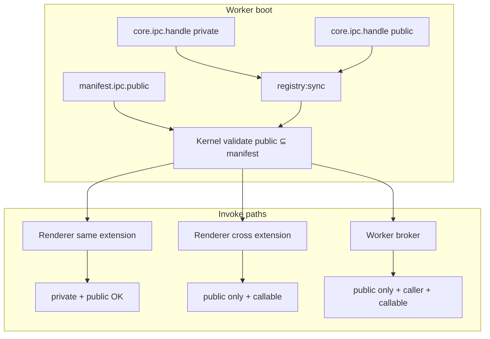

# IPC public/private security refactor

**Status:** Implemented (see [`06-ipc-public-private-security-gaps.md`](./06-ipc-public-private-security-gaps.md))  
**Priority:** Security-first  
**Related:** Nyaa ↔ qBittorrent handoff, IPC Explorer, cross-extension broker

---

## Problem

Today every channel registered with `core.ipc.handle()` is treated the same:

1. **Discovery** — all channels appear in `runtime.ipcChannels` via `kernel/listInstalledExtensions`.
2. **Renderer invoke** — any registered channel on any extension can be called from the renderer (`window.core.ipc.invoke`), with no `caller` / `callable` check and no public/private distinction.
3. **Worker broker** — enforces `capabilities.caller` on the source and `capabilities.callable` on the target, but still allows any registered channel once those flags pass.
4. **IPC Explorer** — surfaces the full channel list and lets the user invoke anything that passes (2), which makes the system look fully open even when we intend isolation.

This contradicts the security model described in `website/docs/design/security.md`: cross-module calls should go through the kernel firewall and only touch an extension’s **declared public surface**.

Separately, **Nyaa settings** currently hide/show the “Add via torrent client” enter action based on a runtime probe (`getEnterActionOptions` → `resolveReadyTorrentClient` → qBittorrent `getStatus`). That couples UI configuration to live service health and bypasses the idea that **exposed APIs are static and auditable in the manifest**.

---

## Goals

| Goal   | Description                                                                                                                  |
| ------ | ---------------------------------------------------------------------------------------------------------------------------- |
| **G1** | Split IPC channels into **public** (cross-extension / cross-tool) and **private** (same extension only).                     |
| **G2** | **Manifest is the source of truth** for the public IPC surface (static, reviewable at install time).                         |
| **G3** | Kernel **enforces** public/private on both renderer and worker broker paths.                                                 |
| **G4** | Discovery APIs and IPC Explorer show **both** lists, clearly labeled; invoke UI only allows **legal** calls.                 |
| **G5** | qBittorrent declares a minimal public surface (at minimum `getStatus`; likely also `add` for torrent handoff).               |
| **G6** | Nyaa **settings become static** — remove runtime conditional options; runtime errors happen at action time, not in Settings. |

## Non-goals (this plan)

- JSON Schema validation of payloads at the kernel (future hardening).
- Per-channel ACL beyond public/private (e.g. per-caller allowlists).
- Changing deeplink routing semantics (`nuxy://…` / `add` scheme).
- Rewriting all existing extensions in one pass (phased migration with compat window).

---

## Target security model

### Visibility vs invokability

| Class               | Visible in discovery? | Callable by own frontend (renderer) | Callable by other extension frontend | Callable by other extension worker (broker)  |
| ------------------- | --------------------- | ----------------------------------- | ------------------------------------ | -------------------------------------------- |
| **Private**         | Yes (labeled)         | Yes                                 | **No**                               | **No**                                       |
| **Public**          | Yes (labeled)         | Yes                                 | Yes (if target `callable`)           | Yes (if caller `caller` + target `callable`) |
| **Kernel channels** | Separate whitelist    | Yes (whitelist)                     | Yes (whitelist)                      | Subset via `callKernelChannel`               |

Private channels cover internal UI wiring (`list`, `pause`, `notes:delete`, …).  
Public channels cover intentional integration points (`getStatus`, `add`, provider `eval`, …).

### Manifest-first public surface

Each extension may declare:

```json
{
  "ipc": {
    "public": ["getStatus", "add"]
  }
}
```

Rules:

- A channel may be invoked cross-extension **only if** it appears in `manifest.ipc.public`.
- Backend registration must **explicitly mark** public handlers; kernel rejects `registry:sync` if:
  - a handler is marked public but not listed in the manifest, or
  - a manifest public channel has no registered handler after worker boot (warning in dev, error in strict mode optional).

Default: **`core.ipc.handle()` registers private**. Public requires an explicit opt-in aligned with the manifest.

---

## Current entry points (as-is)

### Registration (worker)

| File                                        | Role                                                                                   |
| ------------------------------------------- | -------------------------------------------------------------------------------------- |
| `packages/extension-host/src/core-proxy.ts` | `core.ipc.handle()` pushes channel name into `ipcChannels[]`, registers worker handler |
| `packages/extension-host/src/index.ts`      | Sends `registry:sync` with `{ ipcChannels, displayName, registeredEntries }`           |
| `src/electron/spawn/spawn.ts`               | Receives sync, calls `mergeRuntimeSync(extId, payload)`                                |

### Registry (main process)

| File                                  | Role                                                                              |
| ------------------------------------- | --------------------------------------------------------------------------------- |
| `src/electron/extensions/registry.ts` | `ipcChannelsByExtId`, `setExtensionChannels`, `isChannelAllowed` (existence only) |
| `src/electron/extensions/scanner.ts`  | Loads manifest; no IPC surface validation today                                   |

### Invoke paths

| Path                 | Entry                                                                                | Checks today                         |
| -------------------- | ------------------------------------------------------------------------------------ | ------------------------------------ |
| Renderer → extension | `src/electron/ipc/register.ts` → `validateExtInvokeArgs` → `invokeWorker`            | Extension exists; channel registered |
| Renderer → kernel    | same                                                                                 | `KERNEL_CHANNELS` whitelist          |
| Worker → worker      | `src/electron/spawn/host-handlers.ts` `BROKER_INVOKE` → `src/electron/ipc/broker.ts` | caller/callable + channel registered |
| Worker → kernel      | `broker.ts` → `callKernelChannel`                                                    | Small broker subset                  |

### Discovery

| Consumer     | Entry                                                     | Data used                            |
| ------------ | --------------------------------------------------------- | ------------------------------------ |
| Settings     | `extensions/settings/data.ts` → `listInstalledExtensions` | Extension list, schemas              |
| IPC Explorer | `extensions/ipc-explorer/controller.ts`                   | `runtime.ipcChannels` (all channels) |
| Nyaa (today) | `extensions/nyaa/utils/resolve-torrent-client.ts`         | broker → qBittorrent `getStatus`     |

### Nyaa settings dynamism (to remove)

| File                            | Dynamic behavior                                                                    |
| ------------------------------- | ----------------------------------------------------------------------------------- |
| `extensions/nyaa/backend.ts`    | `getEnterActionOptions`, `loadEnterActionOptions`, `resolveReadyTorrentClient`      |
| `extensions/settings/data.ts`   | Fetches `getEnterActionOptions`, patches `nyaaEnterActionOptions`                   |
| `extensions/settings/meta.ts`   | Replaces Nyaa `enterAction` select options when `nyaaEnterActionOptions.length > 0` |
| `extensions/nyaa/controller.ts` | Loads option labels via `getEnterActionOptions`                                     |

---

## Proposed architecture

### 1. Types (`packages/core`)

**File:** `packages/core/src/types.ts`

Extend manifests and runtime meta:

```ts
export interface ExtensionIpcManifest {
  /** Channels callable cross-extension. Must match explicit backend registration. */
  public?: string[]
}

export interface ExtensionRuntimeMeta {
  /** @deprecated alias — use privateIpcChannels + publicIpcChannels */
  ipcChannels?: string[]
  privateIpcChannels: string[]
  publicIpcChannels: string[]
  displayName?: string
  registeredEntries?: RegistryEntry[]
}
```

Migration: during transition, kernel may compute `ipcChannels = [...private, ...public]` for backward compat.

### 2. SDK registration API (`packages/extension-host`)

**File:** `packages/extension-host/src/core-proxy.ts`

Replace implicit-public behavior:

```ts
// Option A (recommended): overload
core.ipc.handle('list', handler) // private
core.ipc.handle('getStatus', handler, { expose: 'public' }) // public

// Option B: separate methods
core.ipc.handlePrivate('list', handler)
core.ipc.handlePublic('getStatus', handler)
```

Sync payload becomes:

```ts
getSyncPayload(): ExtensionRuntimeMeta => ({
  privateIpcChannels: [...privateChannels],
  publicIpcChannels: [...publicChannels],
  ipcChannels: [...privateChannels, ...publicChannels], // compat
  ...
})
```

**Entry:** `packages/extension-host/src/core-proxy.test.ts` — registration + sync payload tests.

### 3. Registry enforcement (`src/electron/extensions/registry.ts`)

Add:

```ts
publicIpcChannelsByExtId: Map<string, Set<string>>
privateIpcChannelsByExtId: Map<string, Set<string>>

function isPublicChannel(extId: string, channel: string): boolean
function isPrivateChannel(extId: string, channel: string): boolean

function validateIpcSync(
  extId: string,
  manifestPublic: string[] | undefined,
  runtime: ExtensionRuntimeMeta
): ValidationResult
```

**On `mergeRuntimeSync`:**

1. Validate public channels ⊆ manifest.ipc.public.
2. Validate manifest.ipc.public ⊆ registered public handlers (warn or fail).
3. Store split maps; keep combined set for legacy `isChannelAllowed`.

**Entry tests:** `src/electron/extensions/registry.test.ts`

### 4. Renderer invoke — add caller identity

**Problem:** `ext:invoke` today has no caller context, so the kernel cannot distinguish “Nyaa frontend calling qBittorrent” vs “qBittorrent calling itself”.

**Proposed change:**

| File                                | Change                                                                        |
| ----------------------------------- | ----------------------------------------------------------------------------- |
| `src/electron/bootstrap/preload.ts` | `invoke(extId, channel, payload, options?: { callerExtId?: string })`         |
| `src/electron/ipc/register.ts`      | Forward optional `callerExtId` to validator                                   |
| `src/electron/ipc/validate.ts`      | New function `validateExtensionInvoke({ targetExtId, channel, callerExtId })` |

**Caller resolution (priority order):**

1. Explicit `options.callerExtId` from caller (tool frontend knows `this.extensionId`).
2. Fallback `undefined` → treat as **trusted shell/kernel UI** (Settings, IPC Explorer only if granted — see below).

**Validation rules (extension target):**

```
if callerExtId === targetExtId:
  allow if channel ∈ private ∪ public
else if callerExtId is set:
  allow if channel ∈ public AND target.manifest.capabilities.callable
else:
  // legacy / shell — tighten over time
  allow if channel ∈ public only   // OR deny all cross-ext without callerExtId
```

Recommendation: **require `callerExtId` for all cross-extension renderer invokes**; kernel returns `CALLER_REQUIRED` if missing. Shell passes active tool id from `nuxy-tool-host`.

| File                                                              | Change                                                                     |
| ----------------------------------------------------------------- | -------------------------------------------------------------------------- |
| `extensions/ui-default/src/components/ToolHost/nuxy-tool-host.ts` | Wrap or document that tools should pass `extensionId` when invoking others |
| `packages/extension-sdk` (optional)                               | `invokeIpc({ callerExtId, targetExtId, channel, payload })` helper         |

### 5. Worker broker (`src/electron/ipc/broker.ts`)

Add after existing checks:

```ts
if (!isPublicChannel(targetId, channel)) {
  return { success: false, error: 'Channel is not public', code: 'IPC_PRIVATE' }
}
```

Private channels remain reachable only inside the same worker (direct handler table), never via broker.

**Entry tests:** `src/electron/ipc/broker.test.ts` — Nyaa→qBittorrent `getStatus` allowed; `list` denied.

### 6. Kernel discovery API

**Option A — extend existing channel (minimal):**

`listInstalledExtensions` returns:

```ts
runtime: {
  privateIpcChannels: string[]
  publicIpcChannels: string[]
}
```

**Option B — dedicated channel (clearer for tools):**

New kernel channel `listExtensionIpcSurfaces` → `{ extId, public: string[], private: string[] }[]`

Recommendation: **Option A** plus IPC Explorer reading split fields; add Option B only if payload size becomes an issue.

| File                                             | Entry                                              |
| ------------------------------------------------ | -------------------------------------------------- |
| `src/electron/ipc/kernel-handlers/extensions.ts` | Include split runtime in `listInstalledExtensions` |
| `packages/core/src/types.ts`                     | Type updates                                       |

### 7. IPC Explorer (dev tool)

**Files:**

- `extensions/ipc-explorer/utils/parse-targets.ts`
- `extensions/ipc-explorer/controller.ts`
- `extensions/ipc-explorer/nuxy-tool-ipc-explorer.ts`

Changes:

1. Parse `publicIpcChannels` / `privateIpcChannels` (fallback: treat all as private if legacy sync).
2. UI sections: **Public** (green) / **Private** (muted, same-extension only).
3. Invoke button disabled when:
   - target ≠ `com.nuxy.ipc-explorer` and channel is private, or
   - cross-extension public call but target not `callable`.
4. Pass `callerExtId: 'com.nuxy.ipc-explorer'` on invoke (still cannot call others’ private channels).
5. Show kernel rejection message (`IPC_PRIVATE`, `CALLER_DENIED`, …) in result panel.

IPC Explorer becomes a **conformance tester** for the public surface, not a bypass.

---

## Nyaa + qBittorrent integration (concrete)

### qBittorrent manifest

**File:** `extensions/qbittorrent/manifest.json`

```json
{
  "capabilities": { "callable": true, "caller": false },
  "ipc": {
    "public": ["getStatus", "add"]
  }
}
```

Backend marks only those handlers public; `list`, `pause`, `remove`, … stay private.

**Files:**

| File                                           | Change                                                                              |
| ---------------------------------------------- | ----------------------------------------------------------------------------------- |
| `extensions/qbittorrent/backend.ts`            | `handle('getStatus', …, { expose: 'public' })`, same for `add`                      |
| `extensions/qbittorrent/tests/backend.test.ts` | Assert sync classifies channels correctly (via exported helper or integration test) |

### Nyaa — static settings

**File:** `extensions/nyaa/settings.json`

Add third option statically:

```json
{
  "value": "torrentClient",
  "label": "Add via torrent client"
}
```

Remove all runtime option building from Settings.

**Files to change:**

| File                                                    | Action                                                                                                                  |
| ------------------------------------------------------- | ----------------------------------------------------------------------------------------------------------------------- |
| `extensions/nyaa/settings.json`                         | Add static `torrentClient` option                                                                                       |
| `extensions/nyaa/backend.ts`                            | Remove `getEnterActionOptions`, `loadEnterActionOptions`; simplify `getEnterAction` to read setting + static validation |
| `extensions/nyaa/utils/enter-action-options.ts`         | Remove `buildEnterActionOptions`; keep constants + `normalizeEnterAction` against static set                            |
| `extensions/nyaa/controller.ts`                         | Remove `getEnterActionOptions` fetch; use static labels map                                                             |
| `extensions/settings/data.ts`                           | Remove `nyaaEnterActionOptions` fetch block                                                                             |
| `extensions/settings/meta.ts`                           | Remove Nyaa dynamic option branch                                                                                       |
| `extensions/settings/controller.ts`                     | Remove `nyaaEnterActionOptions` prop                                                                                    |
| `extensions/settings/tests/computeSettingsMeta.test.ts` | Update fixtures                                                                                                         |

### Nyaa — runtime handoff (unchanged intent, stricter enforcement)

Handoff at Enter key remains runtime:

| File                                              | Behavior                                                                                |
| ------------------------------------------------- | --------------------------------------------------------------------------------------- |
| `extensions/nyaa/utils/torrent-handoff.ts`        | Renderer invokes qBittorrent `getStatus` then `add` with `callerExtId: 'com.nuxy.nyaa'` |
| `extensions/nyaa/utils/resolve-torrent-client.ts` | Worker path: broker enforces public `getStatus` only                                    |

**Remove readiness as a Settings gate.** If user selects `torrentClient` but qBittorrent is down, Enter shows an error toast/message from handoff — not a hidden setting.

Optional simplification: drop `resolveReadyTorrentClient` discovery entirely; Nyaa always targets `com.nuxy.qbittorrent` for `torrentClient` mode (explicit coupling in Nyaa manifest/docs, not auto-discovery). Discovery across multiple `add` deeplink extensions can be a follow-up once public IPC is stable.

---

## Implementation phases

### Phase 0 — Spec & docs (no runtime change)

- [ ] This plan reviewed
- [ ] Update `rules/MANIFEST_GUIDE.md` with `ipc.public`
- [ ] Update `rules/EXTENSION_GUIDE.md` § Backend IPC
- [ ] Update `website/docs/api/ipc.md` and `website/docs/design/security.md`

### Phase 1 — Core split (registry + sync)

**Entry points:**

1. `packages/core/src/types.ts`
2. `packages/extension-host/src/core-proxy.ts`
3. `src/electron/extensions/registry.ts`
4. `src/electron/spawn/spawn.ts`

**Deliverable:** Runtime exposes `privateIpcChannels` / `publicIpcChannels`; backward compat `ipcChannels`.

### Phase 2 — Kernel enforcement

**Entry points:**

1. `src/electron/ipc/validate.ts` — `validateExtensionInvoke`
2. `src/electron/ipc/register.ts` — optional 4th arg / options object
3. `src/electron/ipc/broker.ts` — public-only cross-worker
4. `src/electron/bootstrap/preload.ts` — callerExtId plumbing

**Deliverable:** Private cross-extension calls return `IPC_PRIVATE` / `CALLER_DENIED`.

### Phase 3 — Extension migrations (pilot)

**Entry points:**

1. `extensions/qbittorrent/manifest.json` + `backend.ts`
2. `extensions/nyaa/settings.json` + backend/settings integration removal
3. `extensions/nyaa/utils/torrent-handoff.ts` — pass callerExtId

**Deliverable:** Nyaa static settings; qBittorrent public surface documented and enforced.

### Phase 4 — IPC Explorer & tooling

**Entry points:**

1. `extensions/ipc-explorer/**`
2. Optional: `packages/ext-devserver` mock kernel returns split channels

**Deliverable:** Explorer reflects security model; cannot invoke illegal targets.

### Phase 5 — Rollout remaining extensions

Audit bundled extensions; mark public channels explicitly:

| Extension          | Likely public              | Notes                |
| ------------------ | -------------------------- | -------------------- |
| `calculator`       | `eval`                     | Provider convention  |
| `notes`            | `eval`                     | Provider convention  |
| `download-manager` | `add`, `registerExternal`? | Deeplink integration |
| `ollama`           | `models`, `health`?        | Only if cross-called |
| Most tools         | none                       | UI-private only      |

Default: **everything private** until manifest entry added.

---

## Test plan

| Area                | File                                            | Cases                                             |
| ------------------- | ----------------------------------------------- | ------------------------------------------------- |
| Registry validation | `registry.test.ts`                              | public ⊆ manifest; unknown public rejected        |
| Broker              | `broker.test.ts`                                | public OK; private → `IPC_PRIVATE`                |
| Renderer validate   | `validate.test.ts`                              | same-ext private OK; cross-ext private denied     |
| qBittorrent         | `extensions/qbittorrent/tests/backend.test.ts`  | public handlers registered                        |
| Nyaa                | `extensions/nyaa/tests/backend.test.ts`         | static `getEnterAction`; remove options IPC tests |
| Nyaa handoff        | `extensions/nyaa/tests/torrent-handoff.test.ts` | callerExtId passed; private channel blocked       |
| IPC Explorer        | `extensions/ipc-explorer/tests/*.ts`            | parse public/private; invoke gating               |
| E2E (optional)      | `src/e2e/kernel.spec.ts`                        | mergeRuntimeSync split fields                     |

All changes follow repo TDD: failing tests first, then implementation.

---

## Acceptance criteria

1. **Private channel isolation:** Nyaa worker cannot broker-invoke qBittorrent `list` or `remove` (`IPC_PRIVATE`).
2. **Public channel access:** Nyaa worker can broker-invoke qBittorrent `getStatus` when manifest + registration align.
3. **Renderer cross-tool:** Nyaa frontend can invoke qBittorrent `getStatus` / `add` with `callerExtId`; cannot invoke `pause`.
4. **Settings static:** Nyaa Settings always shows three enter actions; no `getEnterActionOptions` IPC.
5. **Discovery truth:** `listInstalledExtensions` (or successor) exposes separate public/private lists; IPC Explorer labels them.
6. **No silent bypass:** IPC Explorer cannot invoke private channels on other extensions.
7. `pnpm -C src test`, `pnpm typecheck`, `pnpm check` pass.

---

## Open decisions

| #   | Question                                                    | Recommendation                                                                           |
| --- | ----------------------------------------------------------- | ---------------------------------------------------------------------------------------- |
| 1   | Require `callerExtId` for all cross-ext renderer calls?     | **Yes** — fail closed                                                                    |
| 2   | Settings extension invoking Nyaa `getEnterAction` — caller? | Pass `com.nuxy.settings`; keep `getEnterAction` **private**                              |
| 3   | Auto-discovery of torrent clients vs fixed qBittorrent id?  | **Fixed id for v1**; discovery later via public `getStatus` on manifest-declared clients |
| 4   | Legacy extensions without `ipc.public`                      | All channels private; cross-ext blocked until manifest updated                           |
| 5   | IPC Explorer special privileges?                            | **No** — same rules; optional future `capabilities.debug` if needed                      |

---

## Summary diagram



---

## File index (quick reference)

| Layer            | Primary files                                                                                |
| ---------------- | -------------------------------------------------------------------------------------------- |
| Types            | `packages/core/src/types.ts`, `packages/core/src/messages.ts`                                |
| SDK              | `packages/extension-host/src/core-proxy.ts`                                                  |
| Registry         | `src/electron/extensions/registry.ts`                                                        |
| Security gate    | `src/electron/ipc/validate.ts`, `src/electron/ipc/broker.ts`, `src/electron/ipc/register.ts` |
| Preload          | `src/electron/bootstrap/preload.ts`                                                          |
| Discovery        | `src/electron/ipc/kernel-handlers/extensions.ts`                                             |
| Pilot extensions | `extensions/qbittorrent/**`, `extensions/nyaa/**`, `extensions/settings/**`                  |
| Dev tool         | `extensions/ipc-explorer/**`                                                                 |
| Docs             | `rules/MANIFEST_GUIDE.md`, `rules/EXTENSION_GUIDE.md`, `website/docs/api/ipc.md`             |
