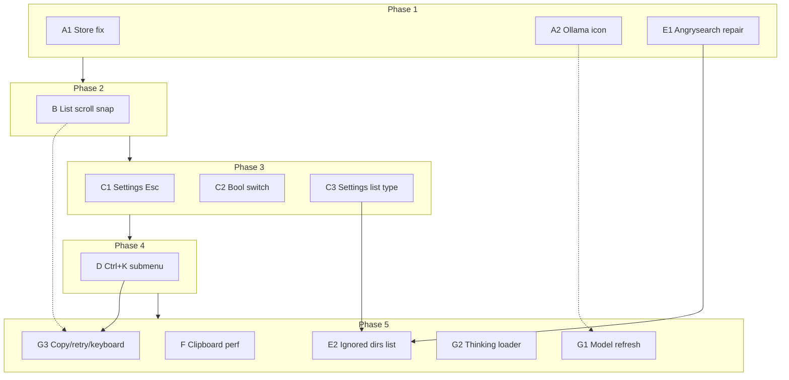

# UI & extensions backlog — implementation plan (2026-06-21)

Grouped implementation plan for twelve backlog items from the 2026-06-21 review.
Items are ordered within each group; **cross-group order** is in [Recommended execution order](#recommended-execution-order).

---

## Summary table

| Group                    | Items                                               | Effort | Blocks / blocked by                                 |
| ------------------------ | --------------------------------------------------- | ------ | --------------------------------------------------- |
| A — Quick fixes          | Store layout, Ollama icon                           | S      | —                                                   |
| B — UI kit (List scroll) | Forward-scroll edge snap                            | M      | Blocks polish on all list consumers                 |
| C — Settings UX          | Esc from input, bool → switch, list field type      | M      | List field type **blocks** angrysearch ignored-dirs |
| D — Shell (Ctrl+K)       | Submenu Esc + selection memory                      | S      | **Should land before** Ollama Ctrl+K actions        |
| E — Angrysearch          | Extension repair + ignored-dirs list                | M–L    | Repair first; list UI **blocked by** Group C        |
| F — Clipboard perf       | Avoid sync stall on live read                       | M      | Independent; do not regress polling                 |
| G — Ollama polish        | Model refresh, thinking loader, copy/retry/keyboard | L      | Icon (A) first; Ctrl+K items **blocked by** Group D |

**Effort key:** S = small (≤1 day), M = medium (1–3 days), L = large (3+ days or multi-surface).

---

## Group A — Quick fixes

High-visibility bugs with isolated diffs. No cross-group dependencies.

### A1. Store — left panel empty, layout broken

**Source item:** #7 (store düzgün gözükmüyor)

**Root cause (confirmed):** `nuxy-tab-bar` expects `tabs` as a **JSON string**; store passes a raw array → `parseTabs()` fails → empty left panel.

**Plan:**

1. Fix `extensions/store/frontend.ts`: pass `tabs=${JSON.stringify(...)}` (or equivalent string binding).
2. Re-test three-column layout inside `nuxy-two-panel` right slot (categories | list | detail).
3. Decide detail-panel behavior on narrow windows:
   - **Recommended:** keep single `nuxy-two-panel`; detail column collapses or overlays when no selection (do **not** nest two `nuxy-two-panel` instances — resize handles and focus areas would conflict).
4. Wire `focusArea` to tab-bar keyboard highlight if missing after fix.
5. TDD: extend `extensions/store/tests/nuxy-tool-store.test.ts` — tab bar receives non-empty tabs.

**Three-panel vs two two-panel answer:** Nesting two `nuxy-two-panel` components is **not recommended**. One two-panel shell + a flex row for list/detail inside the right slot matches clipboard/nyaa patterns and avoids double drag-handles.

**Files:** `extensions/store/frontend.ts`, `extensions/store/controller.ts`, `extensions/ui-default/src/components/TabBar/nuxy-tab-bar.ts`.

---

### A2. Ollama — add icon

**Source item:** #3 (ollama için bir ikon eklenmeli)

**Root cause:** Manifest declares `"icon": "ai"` but `extensions/icons-default/icons.json` has no `ai` entry → `nuxy-icon` renders nothing.

**Plan:**

1. Add `ai.svg` to icons-default **or** change manifest icon to an existing name (`zap`, `send`, etc.).
2. Verify tool list, omnibar, and Ctrl+K palette show the icon.

**Files:** `extensions/icons-default/icons.json` (+ SVG asset), or `extensions/ollama/manifest.json`.

**Blocks:** nothing. **Blocked by:** nothing.

---

## Group B — UI kit: List forward-scroll edge snap

**Source item:** #4 (list elemanı forward-looking scroll…)

**Problem:** When navigating upward with forward-looking scroll bias, the computed scroll target can land slightly negative (e.g. −12px from list `padding-block: 6px` × 2). The scroll is rejected; the active item stays partially off-screen instead of snapping flush to the container edge (0px).

**Plan:**

1. In `extensions/ui-default/src/hooks/scroll-into-view.ts`:
   - Clamp scroll targets to `[0, scrollHeight − clientHeight]`.
   - When `scrollBias` is `'up'` and the item would need a small negative offset, snap to `scrollTop = 0` instead of skipping scroll.
   - Mirror for `'down'` → snap to max scroll when near bottom.
2. Add unit tests in `scroll-into-view.test.ts` for the −12px / edge-snap cases.
3. Smoke-test consumers: shell omnibar lists, settings select-box dropdowns, settings right panel, angrysearch results.

**Files:** `extensions/ui-default/src/hooks/scroll-into-view.ts`, `scroll-into-view.test.ts`, optionally `nuxy-list.ts` if a new `scroll-edge-snap` attribute is needed.

**Blocks:** Better keyboard UX everywhere lists scroll. **Blocked by:** nothing — do early.

---

## Group C — Settings UX

**Source items:** #1 (Esc from input), #2 (yes/no → switch), foundation for #9 (list field type).

Shared surface: `extensions/settings/{frontend,controller,meta,actions}.ts`.

### C1. Esc exits focused setting input

**Current behavior:** Esc on a text input only blurs locally; Esc globally closes open select dropdowns only.

**Plan:**

1. When a settings text/color input is focused, Esc should:
   - blur the input, **and**
   - bubble to controller so ArrowLeft-style “leave field” semantics apply if desired, **or**
   - at minimum, return focus to the settings list row (match user expectation: “Esc ile çık”).
2. Align with `buildRightPanelKeyActions()` — avoid fighting shell Escape routing.
3. Test: Esc from extension text setting returns to list navigation without closing the tool.

---

### C2. Boolean settings → switch (not Yes/No dropdown)

**Current behavior:**

- Extension enable rows → `nuxy-switch` (`isExtToggle`)
- Kernel booleans + extension `type: "toggle"` → `nuxy-select-box` with Yes/No

**Plan:**

1. Render `nuxy-switch` for all boolean rows (kernel + extension schema `type: "toggle"`).
2. Keyboard: Enter on a bool row toggles value (no dropdown open).
3. Remove or narrow `BOOL_OPTIONS` usage in `settingsOptions.ts`.
4. Tests: bool row renders switch; Enter flips value.

---

### C3. Settings `list` field type (foundation)

**Needed for:** angrysearch ignored directories (#9), future tag/list settings.

**Pattern to follow:** Language list in `extensions/settings/meta.ts` — add row + per-item remove rows, backed by a string array in storage.

**Plan:**

1. Extend settings schema with `type: "list"` (or reuse a `"tags"` concept): `{ items: string[], addPlaceholder?, validate? }`.
2. Generic list UI in `frontend.ts`: text input + Add button, removable chips/rows (mirror language list, without i18n catalog).
3. Persist as JSON array in extension settings (not comma-separated CSV).
4. Migration helper: on read, split legacy comma-separated strings into arrays (angrysearch `ignoredRoots`).
5. TDD: meta assembly + add/remove persistence.

**Blocks:** Group E2 (angrysearch ignored dirs). **Blocked by:** nothing within settings.

---

## Group D — Shell: Ctrl+K submenu behavior

**Source item:** #8 (Ctrl+K alt menü Esc + seçili eleman korunmalı)

**Current behavior** (`extensions/shell/nuxy-command-palette.ts`):

- Esc calls `_goBack()` — **already returns to parent menu** when `menuStack.length > 1`; otherwise closes palette. ✓ partial
- `_openSubmenu()` and `_goBack()` both reset `_selectedIndex = 0` ✗
- Opening submenu clears search query ✓

**Plan:**

1. **Preserve selection on submenu enter/exit:**
   - Store `_parentSelectedIndex` (or a stack of indices parallel to `_menuStack`) when opening a submenu.
   - On `_goBack()`, restore parent index instead of resetting to 0.
   - When opening submenu via Enter/ArrowRight, optionally pre-select first child (current) — document choice; user asked parent item stays highlighted when **returning**.
2. Verify Esc in submenu does **not** close the whole palette (only goes up one level) — add/extend e2e in `extensions/shell/tests/e2e.spec.ts` (submenu Esc test exists for ArrowRight path; assert index restoration).
3. Unit tests in `command-palette-controller.test.ts` or dedicated palette tests for index stack.

**Files:** `extensions/shell/nuxy-command-palette.ts`, shell e2e tests.

**Blocks:** Group G3 (Ollama “copy last message / retry” as Ctrl+K children). **Blocked by:** nothing.

---

## Group E — Angrysearch

**Source items:** #5 (çalışmıyor), #9 (ignored directories as list).

### E1. Angrysearch — make extension usable

**Likely causes (investigation done):**

| Issue                                                                 | Impact                                                |
| --------------------------------------------------------------------- | ----------------------------------------------------- |
| Missing `locales/{en,tr,ja}.json` (declared in manifest, not in repo) | Blank labels, raw i18n keys                           |
| Index still building (`isUpdating`)                                   | Empty results, no progress UI                         |
| 3-char minimum                                                        | “Broken” feel for short queries                       |
| Tool-only activation                                                  | User must open “angrysearch” tool, not generic search |
| Settings change does not trigger re-index                             | Stale ignored paths until manual update               |

**Plan:**

1. Add missing locale files (copy keys from manifest usage / controller).
2. Surface index state in UI: progress or “indexing…” empty state via backend `isUpdating` flag.
3. Confirm DB + FTS4 path works end-to-end; add smoke test with temp dir scan root.
4. Optional: trigger `updateDatabase` when `ignoredRoots` / `scanRoot` settings change (can defer to E2).
5. TDD: backend search + controller debounce tests (changelog claims tests missing).

**Files:** `extensions/angrysearch/locales/`, `nuxy-tool-angrysearch.ts`, `backend.ts`, `controller.ts`.

**Blocked by:** nothing. **Do before E2.**

---

### E2. Angrysearch — ignored directories as editable list

**Current:** `ignoredRoots` is comma-separated text in `settings.json`; backend only ignores **direct children** of `scanRoot`.

**Plan:**

1. **Depends on Group C3** — settings `list` field type.
2. Change angrysearch `settings.json`: `ignoredRoots` → `type: "list"`.
3. Backend: accept `string[]`; keep CSV migration for existing users.
4. Consider expanding ignore logic to nested paths (document scope — may be follow-up).
5. Wire settings change → `updateDatabase` (or expose Ctrl+K “Update database” more prominently).

**Blocked by:** C3 (list field type). **Blocked by E1:** soft — can ship list UI before full re-index automation.

---

## Group F — Clipboard performance

**Source item:** #6 (anlık clipboard + sync poll → app slowdown)

**Current architecture:**

- Backend poll (`pollIntervalMs`, default 1s): sync Electron `clipboard.readText()` / `readImage()` on main thread via IPC.
- Frontend poll (`getHistory` every 1.5s): redundant when unchanged.
- `readImage` returns full data URL — expensive for large screenshots.

**Plan:**

1. **Never call sync clipboard read on the renderer hot path** — already true; keep it that way.
2. Backend optimizations:
   - Skip `readImage` when clipboard ownership unchanged if Electron API allows (investigate `clipboard.availableFormats()` cheap check first).
   - Debounce/coalesce poll ticks if previous read still in flight.
   - Respect `storeImages: false` — skip image read entirely.
3. Frontend: align poll interval with backend setting; subscribe to push events if a channel exists (or add lightweight `history:changed` event from backend) instead of blind 1.5s polling.
4. When user invokes “paste latest” / instant read, **do not** block on full history sync — read latest only.
5. TDD: backend skips image read when disabled; frontend does not poll faster than backend.

**Files:** `extensions/clipboard/backend.ts`, `controller.ts`.

**Blocked by:** nothing. **Risk:** Regressions in history freshness — test pin/unpin and new clip detection.

---

## Group G — Ollama polish

**Source items:** #10 (model fetch / gemma:e4b), #11 (thinking loader), #12 (copy/retry/keyboard/Ctrl+K).

### G1. Model list — how `gemma:e4b` appears + live install

**Current behavior:**

- Models from `GET ${host}/api/tags` → `data.models[].name` (no special casing).
- Loaded once on controller connect + separately in Settings `data.ts` for dropdown.
- Default model in settings schema: `llama3`; actual selection = saved model if in list, else `list[0]`.
- **`gemma:e4b` is not hardcoded** — it appears only if Ollama reports that exact tag.

**Live install while app is open:**

- If user pulls a new model in Ollama, Nuxy’s cached list is stale until reload/reconnect.
- Sending chat with unknown model → Ollama HTTP error (handled, but poor UX).

**Plan:**

1. Add `models` refresh: on settings panel focus, on host change, and optional Ctrl+K “Refresh models”.
2. On chat 404/model-not-found, auto-refresh list and surface actionable error.
3. Document in extension README: model names must match `ollama list` exactly.
4. Tests: models handler parses tags; controller falls back when saved model missing.

**Blocked by:** nothing.

---

### G2. Thinking state — inline loader instead of empty black bubble

**Current behavior:** `loading: true` shows `…` only when last message is not yet assistant; once streaming starts an empty assistant `nuxy-chat-message` renders (dark bubble, no content).

**Plan:**

1. Extend `nuxy-chat-message` or ollama template: when assistant message exists but `content === ''` and `loading`, show inline loader (spinner/skeleton) inside the bubble.
2. Do **not** reintroduce undocumented `nuxy-gradient-toggle` window event unless added to approved channels.
3. Optional later: wire `thinkingColor` setting to a subtle border/loader tint.
4. Tests: ollama tool renders loader slot while waiting for first token.

**Files:** `extensions/ollama/nuxy-tool-ollama.ts`, `extensions/ui-default/src/components/ChatMessage/nuxy-chat-message.ts`.

---

### G3. Copy, retry, full keyboard + Ctrl+K menu

**Plan:**

1. **Message actions:** Add copy (assistant + user) and retry (regenerate last turn / resend last user message) to `nuxy-chat-message` action slot or ollama-specific footer.
2. **Keyboard:**
   - Arrow keys to focus messages (if multi-message history).
   - Shortcuts for copy/retry on focused message (e.g. `Ctrl+C`, `Ctrl+R` when message focused — coordinate with angrysearch `Ctrl+R` only when ollama tool active).
   - Enter/Esc behavior unchanged for send/abort.
3. **Ctrl+K entries** (nested under a parent action):
   - “Copy last message”
   - “Retry last response”
   - Reuse model picker children pattern in `controller.ts`.
4. **Depends on Group D** — submenu Esc + index restoration before adding nested ollama menu items.

**Files:** `extensions/ollama/controller.ts`, `nuxy-tool-ollama.ts`, `nuxy-chat-message.ts`, shell palette (consumer only).

**Blocked by:** D (submenu UX), optionally B (list scroll in long chat).

---

## Recommended execution order

Parallel work is possible **within** a phase; **between** phases, respect blockers.

```
Phase 1 — Unblock visible breakage (parallel)
  A1 Store tab-bar fix
  A2 Ollama icon
  E1 Angrysearch locales + index UX

Phase 2 — Shared UI foundation
  B  List scroll edge snap          ← do before heavy list keyboard work

Phase 3 — Settings (sequential inside group)
  C1 Esc from input
  C2 Bool → switch
  C3 List field type                ← gate for E2

Phase 4 — Shell menu
  D  Ctrl+K submenu selection       ← gate for G3 Ctrl+K items

Phase 5 — Extension features (mostly parallel)
  E2 Angrysearch ignored-dirs list  (after C3)
  F  Clipboard perf
  G1 Ollama model refresh
  G2 Ollama thinking loader
  G3 Ollama copy/retry/keyboard     (after D; G2 can merge)
```

---

## Dependency diagram



---

## Open questions (resolve during implementation)

| #   | Question                                                            | Default if no answer                         |
| --- | ------------------------------------------------------------------- | -------------------------------------------- |
| Q1  | Store detail panel: always 320px or collapse when empty?            | Collapse/hide when no selection              |
| Q2  | Angrysearch ignore: direct children only or any nested path?        | Keep current scope; document limitation      |
| Q3  | Ollama `thinkingColor`: wire in G2 or defer?                        | Defer; loader only in G2                     |
| Q4  | Settings Esc: exit input only or exit settings tool?                | Exit input → focus list row (not close tool) |
| Q5  | New settings `list` type: generic or angrysearch-only bespoke rows? | Generic `type: "list"` in schema             |

---

## Acceptance (per group)

| Group | Done when                                                                                                      |
| ----- | -------------------------------------------------------------------------------------------------------------- |
| A     | Store categories visible; ollama icon renders in tool registry                                                 |
| B     | `scroll-into-view.test.ts` covers edge snap; no negative scroll rejection in manual list nav                   |
| C     | Bool rows use switch; Esc leaves text input; list add/remove persists                                          |
| D     | Submenu Esc returns to parent with same highlighted row; e2e green                                             |
| E     | Angrysearch shows labels, returns results after index; ignored dirs manageable as list                         |
| F     | Clipboard poll does not block UI perceptibly; no duplicate 1s+1.5s blind fetch                                 |
| G     | New models appear after refresh; loader visible before first token; copy/retry work via UI + keyboard + Ctrl+K |

---

## Test strategy

Follow repo TDD rule (`CLAUDE.md`): failing test first, then implementation.

| Group         | Test location                                                  |
| ------------- | -------------------------------------------------------------- |
| A Store       | `extensions/store/tests/`                                      |
| B List        | `extensions/ui-default/src/hooks/scroll-into-view.test.ts`     |
| C Settings    | `extensions/settings/tests/` (add if missing)                  |
| D Shell       | `extensions/shell/tests/e2e.spec.ts`, palette unit tests       |
| E Angrysearch | `extensions/angrysearch/tests/`                                |
| F Clipboard   | `extensions/clipboard/tests/backend.test.ts`, controller tests |
| G Ollama      | `extensions/ollama/tests/`                                     |

Run `pnpm -C src test`, `pnpm typecheck`, `pnpm check:fix` before marking any phase complete.
