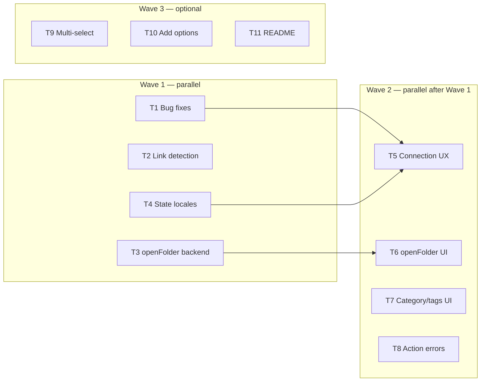

# qBittorrent extension — gap closure plan

Parallel implementation plan for functional gaps identified in the qBittorrent
extension review. Each **track** is sized for one agent on an isolated branch /
worktree. Tracks list owned files, dependencies, and acceptance criteria so
agents can merge independently where possible.

**Baseline:** extension already ships list/add/pause/resume/recheck/reannounce/remove,
Nyaa handoff (`getStatus` + `add` + deeplink), and settings for Web UI auth.

---

## What is actually needed

### P0 — ship blockers / user-visible bugs

| ID   | Gap                                  | Why needed                                         |
| ---- | ------------------------------------ | -------------------------------------------------- |
| P0-1 | Copy save-path shows “magnet copied” | Wrong feedback breaks trust in clipboard actions   |
| P0-2 | Connection errors are raw strings    | Users cannot tell misconfig vs auth vs unreachable |
| P0-3 | No loading state on first fetch      | Blank screen until error or list appears           |
| P0-4 | Torrent action failures are silent   | Pause/remove can fail with no UI signal            |
| P0-5 | Password setting is plain text       | Security/UX regression in settings UI              |

### P1 — parity with Download Manager / daily use

| ID   | Gap                        | Why needed                                                  |
| ---- | -------------------------- | ----------------------------------------------------------- |
| P1-1 | Open save folder           | Copy-only path is insufficient; DM already has `openFolder` |
| P1-2 | Show category/tags in list | Data already fetched; helps identify torrents               |
| P1-3 | Missing state locale keys  | Raw API strings (`forcedDL`, etc.) leak into UI             |
| P1-4 | Broader add-link detection | Non-`.torrent` suffix URLs cannot be added from omnibar     |

### P2 — power features (defer until P0/P1 land)

| ID   | Gap                                      | Notes                                  |
| ---- | ---------------------------------------- | -------------------------------------- |
| P2-1 | Multi-select + bulk pause/remove         | Large controller diff; copy DM pattern |
| P2-2 | Add options (savepath, category, paused) | Settings + backend `add` form fields   |
| P2-3 | Sort/filter (state, progress, speed)     | Settings or omnibar prefix filters     |
| P2-4 | Global transfer stats header             | New `/api/v2/transfer/info` IPC        |
| P2-5 | Local `.torrent` file upload             | Needs `fs` permission + file picker    |
| P2-6 | Torrent properties / file list           | New detail panel + IPC                 |
| P2-7 | Nyaa handoff success toast               | Cross-extension UX when tool closed    |
| P2-8 | README + e2e                             | Docs and regression safety             |

### Explicitly out of scope (for now)

- Provider registration in launcher (not required for Nyaa handoff)
- Alternative torrent-client discovery (hard-coded `com.nuxy.qbittorrent` is intentional per IPC plan)
- TLS / self-signed cert toggle (environment-specific; document workaround in README)
- Priority, force-start, set-location, share limits (niche Web UI parity)

---

## Parallel tracks



### Track T1 — P0 bug fixes (no deps)

**Branch:** `task/qbit-p0-bugs`

**Owns:**

- `extensions/qbittorrent/frontend.ts` — copy feedback: distinguish magnet vs save-path flash (pass copy kind into render or split `copiedHash` → `copiedFeedback: { hash, kind }` in controller)
- `extensions/qbittorrent/controller.ts` — only if flash state shape changes
- `extensions/qbittorrent/settings.json` — password field `"type": "password"` (or platform-equivalent if settings extension supports it)
- `extensions/qbittorrent/tests/frontend.test.ts`, `controller.test.ts`

**Do not touch:** backend, manifest, locales (reuse existing `item.copiedSavePath` key)

**Acceptance:**

- After Shift+C copy save path, list item shows save-path copied message
- Settings password field masks input
- Tests cover both copy feedback paths

---

### Track T2 — P1 add-link detection (no deps)

**Branch:** `task/qbit-torrent-link`

**Owns:**

- `extensions/qbittorrent/utils/torrent-link.ts`
- `extensions/qbittorrent/tests/torrent-link.test.ts`

**Scope (minimal):**

- Accept magnet links without requiring lowercase scheme (already done)
- Accept `magnet:` without `?` prefix edge cases if any
- **Do not** broaden to arbitrary HTTP URLs without `.torrent` suffix in this track — document as follow-up

**Acceptance:**

- `isTorrentLink` tests extended; `pnpm -C src test -- extensions/qbittorrent/tests/torrent-link.test.ts` green
- No controller/frontend changes unless add-mode placeholder copy needs updating (avoid)

---

### Track T3 — P1 openFolder backend (no deps)

**Branch:** `task/qbit-open-folder-backend`

**Owns:**

- `extensions/qbittorrent/manifest.json` — add `"shell"` permission
- `extensions/qbittorrent/backend.ts` — new IPC `openSavePath`
- `extensions/qbittorrent/types.ts` — channel map entry
- `extensions/qbittorrent/tests/backend.test.ts`

**Pattern:** mirror `extensions/download-manager/backend.ts` `openFolder` — use `core.shell.openPath(savePath)` (or existing shell API; read DM backend first).

**IPC:**

```ts
openSavePath: { input: { savePath: string }; output: void }
```

**Acceptance:**

- Handler opens folder via shell API; rejects empty path
- Manifest permissions include `shell`
- Backend tests mock shell and assert call

**Blocks:** T6 only

---

### Track T4 — P1 missing state locales (no deps)

**Branch:** `task/qbit-state-locales`

**Owns:**

- `extensions/qbittorrent/locales/en.json` only if project policy allows agent edits; otherwise add keys via i18n tooling / settings maintainer
- `extensions/qbittorrent/frontend.ts` — optional: normalize `item.state` before lookup (e.g. lowercase → camelCase map in `utils/format.ts` or new `utils/state-label.ts`)

**Preferred approach (locale-safe):** add `normalizeTorrentState(state: string): string` in a new util so existing locale keys work regardless of API casing; add missing keys for `forcedDL`, `forcedUP`, `checkingResumeData`.

**Also owns if util approach:**

- `extensions/qbittorrent/utils/state-label.ts` + `tests/state-label.test.ts`
- `frontend.ts` — use util in `statusLabel()` only

**Acceptance:**

- Known API states render translated labels, not raw strings
- Unit tests for normalization + label fallback

---

### Track T5 — P0 connection UX (deps: T1 merged or coordinate)

**Branch:** `task/qbit-connection-ux`

**Owns:**

- `extensions/qbittorrent/controller.ts` — `refresh()`: set `loading: true` before fetch; map errors via shared helper
- `extensions/qbittorrent/utils/get-status.ts` — export/use `mapQbitError` from list failures OR add `mapListError(err): QbitStatusResult`
- `extensions/qbittorrent/frontend.ts` — error panel uses `error.loadFailed` + `error.loadFailedHint` when state matches; show structured message from `QbitStatusResult` when available
- `extensions/qbittorrent/types.ts` — optional: extend state with `connectionState?: QbitConnectionState`
- Tests: `controller.test.ts`, `get-status.test.ts`

**Scope:**

- On connect, `loading: true` until first `list` resolves
- Store `connectionState` + `error` from mapped result (`misconfigured`, `auth_failed`, `unreachable`)
- Error UI: alert + hint text (no deeplink to settings in this track — hint string only)

**Acceptance:**

- First paint shows loading (shimmer or muted text — reuse existing components)
- Auth failure shows localized hint, not only `Invalid qBittorrent username...`
- Poll continues on error (existing behavior preserved)

**Conflict note:** touches `controller.ts` + `frontend.ts` — **do not run in parallel with T1** unless T1 merges first or T5 rebases after T1.

---

### Track T6 — P1 openFolder UI (deps: T3)

**Branch:** `task/qbit-open-folder-ui`

**Owns:**

- `extensions/qbittorrent/controller.ts` — `openSavePath(item)`, shell action (e.g. `o` key)
- `extensions/qbittorrent/frontend.ts` — only if needed for menu hints
- `extensions/qbittorrent/locales/en.json` — `actions.openFolder` (if allowed)
- `extensions/qbittorrent/tests/controller.test.ts`

**Pattern:** Download Manager `openFolder` action — Ctrl+K menu + keyboard binding.

**Acceptance:**

- Selected torrent → open folder action calls `openSavePath` IPC
- Disabled while item pending or when save path empty
- Controller test asserts invoke channel + payload

**Conflict note:** serializes with T5/T8 on `controller.ts` — merge T3 first, then rebase T6 on main before editing controller.

---

### Track T7 — P1 category/tags in list (no deps on other tracks)

**Branch:** `task/qbit-list-meta`

**Owns:**

- `extensions/qbittorrent/frontend.ts` — append category/tags to `meta` line when non-empty
- `extensions/qbittorrent/tests/frontend.test.ts` — render test or extract `formatItemMeta(item, t)` to testable util

**Optional util (recommended for testability):**

- `extensions/qbittorrent/utils/format-meta.ts` + tests

**Acceptance:**

- Torrent with `category: 'linux'` shows category in meta
- Tags comma-separated when present
- No controller/backend changes

**Conflict note:** only conflicts with T1/T5 on `frontend.ts` — merge those first or own isolated util file.

---

### Track T8 — P0 action error feedback (deps: none, but controller conflict)

**Branch:** `task/qbit-action-errors`

**Owns:**

- `extensions/qbittorrent/controller.ts` — wrap `runTorrentAction`, `remove`, `addTorrent` with `actionError: string | null` state; clear on success/query change
- `extensions/qbittorrent/frontend.ts` — inline alert when `actionError` set (non-blocking, above list)
- `extensions/qbittorrent/locales/en.json` — `error.actionFailed` with `{action}` placeholder if settings i18n supports it
- `extensions/qbittorrent/tests/controller.test.ts`

**Acceptance:**

- Simulated IPC failure on pause surfaces message in UI
- Error clears on next successful refresh or query change
- Does not replace connection error panel (orthogonal states)

**Conflict note:** **serialize with T5/T6** on `controller.ts` — assign one agent to T5+T8 combined if parallel slots are limited.

---

## Wave 3 (optional, after Wave 2)

### Track T9 — P2 multi-select

**Branch:** `task/qbit-multi-select`

Copy `extensions/download-manager/controller.ts` multi-select pattern:
`multiSelectMode`, `checkedIds`, Space to toggle, Ctrl+A select all, bulk pause/remove.

**Large diff — single agent, no parallel controller edits.**

---

### Track T10 — P2 add options

**Branch:** `task/qbit-add-options`

- `settings.json`: default save path, category, start paused
- `backend.ts` / `qbit-client.ts`: pass fields to `/torrents/add`
- Add panel UI when in add mode

---

### Track T11 — P2 README

**Branch:** `task/qbit-readme`

- `extensions/qbittorrent/README.md` — setup, shortcuts, Nyaa integration, troubleshooting
- Optional: `website/docs/extensions/built-in/qbittorrent.md`

---

## Agent assignment matrix

| Track  | Priority | Files touched                    | Parallel with                              | Merge order |
| ------ | -------- | -------------------------------- | ------------------------------------------ | ----------- |
| T1     | P0       | frontend, controller?, settings  | T2, T3, T4, T7                             | 1           |
| T2     | P1       | torrent-link util                | T1, T3, T4, T7                             | 1           |
| T3     | P1       | backend, manifest, types         | T1, T2, T4, T7                             | 1           |
| T4     | P1       | state-label util, frontend?      | T1, T2, T3, T7                             | 1           |
| T7     | P1       | format-meta util, frontend       | T1–T4 if util-only                         | 1           |
| T5     | P0       | controller, frontend, get-status | **after T1**                               | 2           |
| T8     | P0       | controller, frontend             | **after T1**; combine with T5 if one agent | 2           |
| T6     | P1       | controller                       | **after T3**                               | 2           |
| T9–T11 | P2       | large / docs                     | sequential                                 | 3           |

**Maximum parallel agents in Wave 1: 4** (T1 + T2 + T3 + T4/T7)

**Wave 2: 2 agents max** unless T5 and T8 are merged into one PR.

---

## Shared conventions (all tracks)

1. **TDD:** failing test first, then implementation (`pnpm -C src test -- extensions/qbittorrent/...`).
2. **Locales:** do not hand-edit `tr.json` / `ja.json` per project policy; add English keys only or use i18n pipeline.
3. **IPC:** new channels are **private** unless cross-extension need (keep `getStatus` + `add` as only public).
4. **Controller:** single agent per wave for `controller.ts` — rebase before starting if another track merged.
5. **Check:** `pnpm -C src test`, `pnpm typecheck`, `pnpm lint` before PR.

---

## Suggested PR titles

1. `fix(qbittorrent): copy feedback and password field`
2. `feat(qbittorrent): open save path via shell`
3. `fix(qbittorrent): structured connection errors and loading state`
4. `feat(qbittorrent): show category and tags in list`
5. `fix(qbittorrent): surface torrent action failures`
6. `chore(qbittorrent): normalize torrent state labels`

---

## Minimal “done” definition (P0 + P1)

Ship when tracks **T1–T8** (except deferred items) are merged:

- [ ] Copy magnet vs save path feedback is correct
- [ ] Password masked in settings
- [ ] Loading + structured connection error UI
- [ ] Action failures visible
- [ ] Open folder works for selected torrent
- [ ] Category/tags visible when set
- [ ] All qBittorrent list states have human-readable labels
- [ ] Full qbittorrent test suite green

P2 tracks can follow as separate PRs without blocking release.
