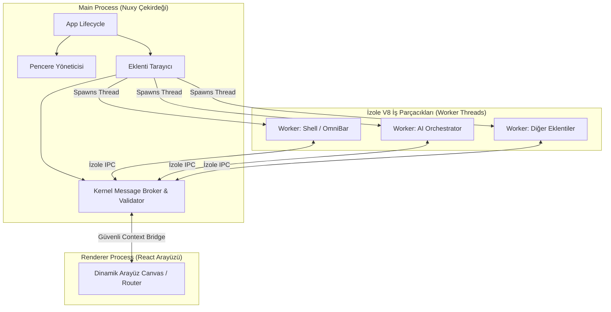

# Nuxy Proje Analizi: Genel Bakış ve Çekirdek Mimarisi

Nuxy, geleneksel bir masaüstü uygulamasından ziyade, kendi başına işlevi olmayan **"Boş Bir Kabuk" (A Bare-Metal Kernel)** olarak tasarlanmıştır. Bu doküman; Nuxy'nin mimarisini, eklenti modelini, güvenlik sınırlarını ve veri akışını detaylı bir şekilde açıklar.

---

## 1. Temel Felsefe: Useless Core (Kullanışsız Çekirdek)

Nuxy'nin en radikal mühendislik ilkesi şudur: **Çekirdek tek başına hiçbir işe yaramamalıdır.**
`~/.nuxy/extensions/` dizini boş olduğunda Nuxy başlatılırsa, ekranda yalnızca "Yüklü eklenti bulunamadı" uyarısı veren şeffaf boş bir pencere görünür. Nuxy'nin arama çubuğu (OmniBar), ayarlar paneli ve tüm araçları aslında birer eklentidir (extension).

Bu yaklaşım, GNOME Extensions modelinden ilham almıştır. Uygulamanın çekirdek kodu şişmez (bloatware haline gelmez) ve kullanıcılar yalnızca ihtiyaç duydukları özellikleri yükleyerek tamamen kişiselleştirilmiş bir verimlilik aracı oluşturabilirler.

---

## 2. Sistem Mimarisi (Architecture)

Nuxy, sistem kaynaklarını korumak ve güvenliği en üst düzeyde tutmak amacıyla **Üç Katmanlı Mimari** kullanır:

### 2.1. Kernel (Ana Süreç - Main Process)

Electron'un ana sürecinde (`src/electron/`) çalışan Kernel, işletim sistemiyle doğrudan konuşabilen tek katmandır. Görevleri:

- `~/.nuxy/extensions/` dizinini tarar ve eklentileri yükler.
- Her eklenti için izole bir Node.js Worker Thread başlatır.
- Eklentiler ile React Renderer arasındaki IPC (Inter-Process Communication) trafiğini yönetir, doğrular ve yönlendirir.

### 2.2. Isolated Worker Threads (Arka Plan - Backend)

Eklentilerin arka plan kodları (`backend.ts`/`backend.js`), Electron ana sürecinde çalışmaz. Her eklenti için ayrı bir **Node.js Web Worker** (`worker_threads`) oluşturulur.

- **Donanımsal Bellek İzolasyonu**: Bir eklenti diğer eklentinin belleğine erişemez veya onun durumunu bozamaz.
- **Kısıtlı Yetkiler**: Worker içinde doğrudan `fs` (dosya sistemi) veya `http` (ağ) çağrıları yapılması engellenir. Bunun yerine Kernel tarafından sağlanan, eklentinin manifest dosyasındaki izinlere göre filtrelenen proxy bir `CoreContext` API'si enjekte edilir.

### 2.3. React Canvas (Ön Yüz - Renderer Process)

Nuxy'nin ön yüzü boş bir tuvaldir. Kernel bir eklentiyi yüklediğinde, React ön yüzü `nuxy-ext://<extension-id>/frontend.js` özel protokolü üzerinden eklentinin arayüz kodunu dinamik olarak içe aktarır (dynamic import).

- **Tasarım Bütünlüğü**: Eklentiler kendi tasarım kütüphanelerini paketlemezler. Nuxy çekirdeğinin küresel olarak sağladığı `@nuxy/ui` (Shadcn tabanlı) bileşenlerini tüketirler. Bu sayede uygulama boyutu küçük kalır ve görsel tutarlılık korunur.
- **Sandbox Güvenliği**: Arayüz katmanı Chromium'un izole edilmiş ve sandbox modundaki renderer sürecinde çalıştığı için sisteme doğrudan zarar veremez.

---

## 3. Sıfır Güven (Zero-Trust) Güvenlik ve İzin Modeli

Eklentiler yerel diskten yüklenen üçüncü taraf kodlar olduğu için Nuxy sıkı güvenlik kuralları uygular:

1.  **Manifest Tabanlı İzinler (Permissions Gate)**: Eklentiler disk, pano veya ağ gibi hassas sistem kaynaklarına erişmek istiyorsa bunu `manifest.json` dosyalarında açıkça belirtmelidir (Örn: `"permissions": ["storage", "clipboard", "shell"]`). Tanımlanmayan bir izin kullanılırsa Kernel IPC seviyesinde `PERMISSION_DENIED` hatası döndürür.
2.  **Depolama Karantinası (Chroot/Jail Storage)**: Eklentiler dosya sisteminde istedikleri yere yazamazlar. `core.storage` API'si, eklentinin yazma ve okuma isteklerini otomatik olarak eklenti kimliğiyle ilişkilendirilmiş izole bir klasöre yönlendirir (`~/.nuxy/data/<manifest.id>/`).
3.  **İletişim Filtresi**: Arayüzün sisteme erişim için tek yolu `window.core.ipc.invoke()` köprüsüdür. Bu köprüden geçen her mesaj Kernel Message Broker tarafından doğrulanır.
