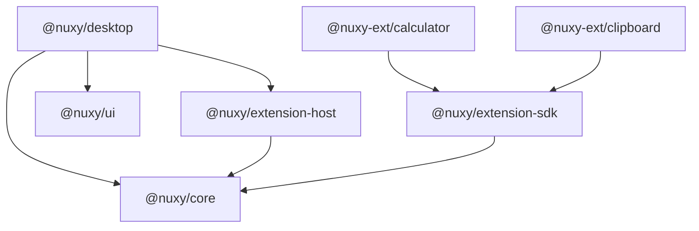

# Nuxy — Current Structure Tree & Restructure Plan

> Generated: 2026-05-19  
> Status: **Phases 2 & 3 complete** — kernel domain folders and `@nuxy/extension-host` package in place; Phase 1 renderer rename is complete (`src/src/` → `src/renderer/`), but relocating desktop app package (`src/` → `apps/desktop/`) is still pending  
> Related: [structure.md](./structure.md), [02-architecture.md](./02-architecture.md), [electron-fix-plan.md](./electron-fix-plan.md)

---

## 1. Current repository tree

Build artifacts (`node_modules/`, `dist/`, `dist-electron/`) are omitted. File counts are approximate.

```text
nuxy/                                    # monorepo root (pnpm workspace)
├── package.json                         # root scripts: dev, test
├── pnpm-workspace.yaml                  # packages/*, apps/*, extensions/*, src
├── tsconfig.json
├── agents.md
│
├── packages/
│   ├── core/                            # @nuxy/core
│   │   └── src/
│   │       ├── index.ts                 # CoreContext interface + re-exports
│   │       ├── types.ts                 # ExtensionManifest, LoadedExtension, …
│   │       └── logger.ts                # kernelLogger, createLogger
│   └── ui/                              # @nuxy/ui
│       └── src/
│           ├── index.tsx                # barrel export
│           └── components/              # 13 React primitives (List, Button, …)
│               ├── Badge/
│               ├── Button/
│               ├── Card/
│               ├── EmptyState/
│               ├── Input/
│               ├── Kbd/
│               ├── List/
│               ├── ListItem/
│               ├── ListItemActions/
│               ├── ListItemBody/
│               ├── ListItemMeta/
│               ├── ListItemText/
│               ├── ShortcutBar/
│               └── ShortcutHint/
│
├── src/                                 # nuxy-desktop app (kernel + renderer in one package)
│   ├── package.json
│   ├── vite.config.ts
│   ├── vitest.config.ts
│   ├── tsconfig.json
│   ├── index.html
│   ├── postcss.config.js
│   ├── tailwind.config.js
│   │
│   ├── electron/                        # Kernel (main process) — 24 modules, mostly flat
│   │   ├── main.ts                      # boot, single-instance, scan → window
│   │   ├── preload.ts
│   │   ├── paths.ts                     # ~/.nuxy path constants
│   │   ├── config.ts                    # re-exports paths
│   │   ├── nuxyconfig.ts                # user config load/validate
│   │   ├── config-runtime.ts            # apply config to BrowserWindow
│   │   ├── storage-path.ts              # chroot for extension data
│   │   ├── registry.ts                  # id ↔ folder maps
│   │   ├── scanner.ts                   # scan ~/.nuxy/extensions, spawn workers
│   │   ├── ipc.ts                       # ipcMain handlers + worker invoke
│   │   ├── ipc-validate.ts
│   │   ├── protocol.ts                  # nuxy-ext:// registration
│   │   ├── protocol-resolve.ts          # path jail + id → folder
│   │   ├── spring.ts                    # window animation helper
│   │   ├── window.ts                    # BrowserWindow factory
│   │   ├── themes/index.ts              # copy bundled themes → ~/.nuxy/themes
│   │   ├── worker/
│   │   │   ├── spawn.ts                 # Worker spawn + host-call bridge (clipboard, storage)
│   │   │   └── extension-host.ts        # isolated thread: builds `core` proxy, loads backend.js
│   │   ├── dev/                         # DEV-only (bundled into main in dev)
│   │   │   ├── extensions.ts            # sync repo extensions/ → ~/.nuxy/extensions/
│   │   │   └── globals.d.ts
│   │   └── *.test.ts                    # colocated unit tests (4 files)
│   │
│   ├── renderer/                        # Renderer (React)
│   │   ├── main.tsx
│   │   ├── App.tsx                      # OmniBar shell, dynamic ext UI
│   │   ├── index.css
│   │   └── env.d.ts                     # window.core typings
│   │
│   └── themes/                          # bundled theme JSON (Tailwind + runtime)
│       ├── default-light.json
│       └── default-dark.json
│
├── extensions/                          # MVP sample extensions (not proper workspace packages)
│   ├── calculator/
│   │   ├── manifest.json
│   │   └── backend.js
│   └── clipboard/
│       ├── manifest.json
│       ├── backend.js
│       └── frontend.js
│
└── docs/                                # 33 markdown files (spec + implementation + changelog)
    ├── 00-overview.md … 20-logging.md   # numbered design series
    ├── architecture.md                  # overlaps 02-architecture.md
    ├── structure.md                     # target layout (partially aspirational)
    ├── electron-fix-plan.md             # completed kernel audit
    ├── implementation/                  # phased build guides
    ├── changelog/
    └── …
```

### 1.1 Runtime topology (logical, not filesystem)

```text
                    ┌─────────────────────────────────────┐
                    │         Main Process (Kernel)         │
                    │  main → scanner → registry → ipc     │
                    │         ↓ spawn                       │
                    │    worker/spawn ←→ extension-host    │
                    └──────────┬────────────────────────────┘
                               │ IPC (validated)
                    ┌──────────▼────────────────────────────┐
                    │    Renderer (React shell in src/src)  │
                    │  preload bridge → App.tsx → nuxy-ext:// │
                    └──────────┬────────────────────────────┘
                               │ dynamic import
                    ┌──────────▼────────────────────────────┐
                    │  Extension frontends (frontend.js)    │
                    │  uses @nuxy/ui components             │
                    └───────────────────────────────────────┘

    ~/.nuxy/
    ├── nuxyconfig
    ├── extensions/<folder>/     ← scanner reads manifests here
    ├── data/<manifest.id>/      ← storage chroot (worker host-call)
    └── themes/*.json
```

---

## 2. Problems with the current layout

| Area                | Issue                                                                           | Impact                                                                       |
| ------------------- | ------------------------------------------------------------------------------- | ---------------------------------------------------------------------------- |
| **Naming**          | ~~`src/src/` for the React app~~ (Resolved to `src/renderer/`)                   | Confusing imports, hard to explain to contributors                           |
| **Monorepo**        | `pnpm-workspace.yaml` lists `apps/*` but folder does not exist                  | Workspace contract lies; `src/` is a pseudo-app at wrong level               |
| **Kernel flatness** | 20+ files directly under `electron/`                                            | Hard to navigate as kernel grows; no domain boundaries                       |
| **Duplicated API**  | `extension-host.ts` builds `core` inline; `packages/core` defines `CoreContext` | Drift risk — host already has `clipboard` not in `CoreContext` type          |
| **Host bridge**     | `spawn.ts` implements clipboard/storage host handlers                           | Mixes process management with capability implementation                      |
| **Extensions**      | Loose `backend.js` / `frontend.js`, no build step in workspace                  | No typecheck, no shared SDK, hard to publish                                 |
| **Themes**          | `src/themes/` (assets) vs `electron/themes/` (copy logic)                       | Split responsibility for one concern                                         |
| **Tests**           | Colocated `*.test.ts` next to production files                                  | Fine for now, but kernel domains will want `__tests__/` or `packages/*/test` |
| **Docs**            | 33 files, overlapping titles (`architecture.md` vs `02-architecture.md`)        | Hard to find canonical truth                                                 |
| **Build output**    | Many hashed files under `dist-electron/` (gitignored)                           | OK if ignored; noisy locally                                                 |

---

## 3. Design goals for the restructure

1. **Filesystem mirrors runtime layers** — kernel, renderer, extensions, shared libs are obvious from the tree.
2. **One package = one deployable or one library** — desktop app lives under `apps/`, not root `src/`.
3. **Kernel grouped by domain** — lifecycle, extensions, IPC, protocol, window, config are separate folders.
4. **Single source for extension API** — worker `core` proxy and TypeScript types come from the same package.
5. **Extensions are first-class workspace members** — buildable, typechecked, publishable as `.nuxyext`.
6. **Docs have a single index** — numbered series stays; duplicates merged or redirected.

---

## 4. Target tree (proposed)

```text
nuxy/
├── apps/
│   └── desktop/                         # was `src/` — the only Electron app
│       ├── package.json                 # name: @nuxy/desktop
│       ├── electron/                    # main process entry: electron/bootstrap/main.ts
│       │   ├── bootstrap/
│       │   │   ├── main.ts
│       │   │   └── preload.ts
│       │   ├── config/
│       │   │   ├── paths.ts
│       │   │   ├── nuxyconfig.ts
│       │   │   └── storage-path.ts
│       │   ├── extensions/
│       │   │   ├── scanner.ts
│       │   │   ├── registry.ts
│       │   │   └── worker/
│       │   │       └── spawn.ts         # spawn only; host script from @nuxy/extension-host
│       │   ├── ipc/
│       │   │   ├── register.ts          # was ipc.ts
│       │   │   ├── invoke-worker.ts
│       │   │   └── validate.ts
│       │   ├── protocol/
│       │   │   ├── register.ts
│       │   │   └── resolve.ts
│       │   ├── window/
│       │   │   ├── manager.ts           # was window.ts
│       │   │   ├── runtime.ts           # was config-runtime.ts
│       │   │   └── spring.ts
│       │   ├── capabilities/            # host-call handlers (extracted from spawn.ts)
│       │   │   ├── clipboard.ts
│       │   │   └── storage.ts
│       │   ├── themes/
│       │   │   └── install.ts           # copy bundled → ~/.nuxy/themes
│       │   └── dev/                     # unchanged role; tree-shaken in prod build
│       ├── renderer/                    # was `src/src/`
│       │   ├── main.tsx
│       │   ├── App.tsx
│       │   └── env.d.ts
│       ├── assets/
│       │   └── themes/
│       │       ├── default-light.json
│       │       └── default-dark.json
│       ├── index.html
│       └── vite.config.ts
│
├── packages/
│   ├── core/                            # types, logger, IPC result shapes (unchanged role)
│   ├── extension-host/                # NEW — worker entry + createCoreProxy()
│   │   └── src/
│   │       ├── index.ts                 # worker bootstrap (from extension-host.ts)
│   │       └── core-proxy.ts            # implements CoreContext via MessagePort
│   ├── extension-sdk/                 # NEW (optional phase 2) — manifest zod schema, helpers
│   │   └── src/
│   │       ├── manifest.ts
│   │       └── register.ts            # typed register() wrapper for extension authors
│   └── ui/                              # unchanged
│
├── extensions/                          # workspace packages (phase 2)
│   ├── calculator/
│   │   ├── package.json               # name: @nuxy-ext/calculator, private: true
│   │   ├── manifest.json
│   │   ├── src/
│   │   │   ├── backend.ts
│   │   │   └── frontend.tsx
│   │   └── vite.config.ts             # emits backend.js + frontend.js to dist/
│   └── clipboard/
│       └── …
│
├── docs/
│   ├── README.md                        # canonical index (only entry point)
│   ├── design/                          # move 00–20 series here
│   ├── plans/                           # restructure-plan.md, electron-fix-plan.md, mvp-plan.md
│   └── changelog/
│
├── package.json
└── pnpm-workspace.yaml                  # apps/*, packages/*, extensions/*
```

### 4.1 Package dependency graph (target)



Rules:

- **Desktop** must not import extension code directly (only scans `~/.nuxy/extensions/`).
- **extension-host** must not import `electron` (runs in `worker_threads`).
- **extension-sdk** is devDependency of extensions; optional runtime dep only for helpers.
- **ui** stays renderer-only; never imported from main process.

### 4.2 File mapping (current → target)

| Current                                 | Target                                                    |
| --------------------------------------- | --------------------------------------------------------- |
| `src/electron/main.ts`                  | `apps/desktop/electron/bootstrap/main.ts`                 |
| `src/electron/preload.ts`               | `apps/desktop/electron/bootstrap/preload.ts`              |
| `src/electron/scanner.ts`               | `apps/desktop/electron/extensions/scanner.ts`             |
| `src/electron/registry.ts`              | `apps/desktop/electron/extensions/registry.ts`            |
| `src/electron/worker/spawn.ts`          | `apps/desktop/electron/extensions/worker/spawn.ts`        |
| `src/electron/worker/extension-host.ts` | `packages/extension-host/src/index.ts`                    |
| `src/electron/ipc.ts`                   | `apps/desktop/electron/ipc/register.ts`                   |
| `src/electron/ipc-validate.ts`          | `apps/desktop/electron/ipc/validate.ts`                   |
| `src/electron/protocol*.ts`             | `apps/desktop/electron/protocol/`                         |
| `src/electron/window.ts`                | `apps/desktop/electron/window/manager.ts`                 |
| `src/electron/config-runtime.ts`        | `apps/desktop/electron/window/runtime.ts`                 |
| `src/electron/nuxyconfig.ts`            | `apps/desktop/electron/config/nuxyconfig.ts`              |
| `src/electron/paths.ts`                 | `apps/desktop/electron/config/paths.ts`                   |
| `src/electron/storage-path.ts`          | `apps/desktop/electron/config/storage-path.ts`            |
| `src/electron/themes/index.ts`          | `apps/desktop/electron/themes/install.ts`                 |
| `src/renderer/*`                        | `apps/desktop/renderer/*`                                 |
| `src/themes/*`                          | `apps/desktop/assets/themes/*`                            |
| `extensions/*/backend.js`               | `extensions/*/src/backend.ts` → build → `dist/backend.js` |

---

## 5. Kernel internal module boundaries

After restructure, each folder owns one concern:

| Module          | Responsibility                                            | Must not                             |
| --------------- | --------------------------------------------------------- | ------------------------------------ |
| `bootstrap/`    | `app` lifecycle, protocol scheme registration, boot order | Extension logic, IPC channel details |
| `config/`       | Paths, `nuxyconfig`, storage path resolution              | UI or worker code                    |
| `extensions/`   | Scan, registry, spawn workers                             | Direct `clipboard` / `fs` in scanner |
| `capabilities/` | Implement host-call channels (`clipboard:*`, `storage:*`) | Spawn workers                        |
| `ipc/`          | `ipcMain` registration, validation, invoke worker         | Filesystem paths                     |
| `protocol/`     | `nuxy-ext://` handler + path jail                         | Window management                    |
| `window/`       | BrowserWindow, drag, resize, spring animation             | Extension scanning                   |
| `themes/`       | Install bundled JSON to `~/.nuxy/themes`                  | React code                           |
| `dev/`          | Sync workspace extensions, debug utilities                | Ship in production bundle            |

**extension-host** (separate package):

- Builds `core` object from `CoreContext` in `@nuxy/core`.
- All privileged operations go through `host:call` messages; desktop `capabilities/` answers them.

This removes the current split where `spawn.ts` both spawns workers and implements clipboard/storage.

---

## 6. Extension workspace model (phase 2)

Each extension becomes a minimal package:

```json
{
  "name": "@nuxy-ext/clipboard",
  "private": true,
  "type": "module",
  "scripts": {
    "build": "vite build",
    "dev": "vite build --watch"
  },
  "devDependencies": {
    "@nuxy/extension-sdk": "workspace:*"
  }
}
```

Build output layout (installed to `~/.nuxy/extensions/<folder>/`):

```text
com.nuxy.clipboard/
├── manifest.json
├── dist/
│   ├── backend.js
│   └── frontend.js
└── icon.svg
```

`manifest.json` `entry` paths point at `dist/` (already documented in [04-modules.md](./04-modules.md)).

Dev sync (`electron/dev/extensions.ts`) copies from `extensions/*/dist/` instead of raw `.js` at package root.

---

## 7. Documentation restructure (parallel track)

Does not block code moves but should happen to avoid drift.

```text
docs/
├── README.md                 # links only — "start here"
├── design/
│   ├── 00-overview.md
│   └── …                     # move numbered series
├── plans/
│   ├── restructure-plan.md   # this file
│   ├── electron-fix-plan.md
│   └── mvp-plan.md
├── implementation/           # keep phased guides
└── changelog/
```

Actions:

- Merge or redirect `architecture.md` → `design/02-architecture.md`.
- Update `structure.md` to point at this plan once phase 1 lands.
- Add one paragraph in `README.md`: "canonical layout = apps/desktop + packages/\*".

---

## 8. Migration phases

### Phase 0 — Hygiene (low risk, do first)

- [x] Confirm `dist-electron/` never committed (already in `.gitignore`).
- [ ] Add `docs/plans/` and move planning docs (optional, can do with phase 1).
- [ ] Update root `package.json` scripts after path changes (`pnpm -C apps/desktop dev`).

**Effort:** ~1 hour  
**Risk:** none

### Phase 1 — Rename & relocate app (`src/` → `apps/desktop/`)

- [ ] Create `apps/desktop/` and move `src/package.json`, vite, vitest, tsconfig, index.html.
- [x] Rename `src/src/` → `renderer/`.
- [ ] Move `src/themes/` → `assets/themes/`.
- [ ] Update `pnpm-workspace.yaml`: remove bare `src`, ensure `apps/*` works.
- [ ] Fix import paths in vite/electron config.
- [ ] Run `pnpm test` and `pnpm -C apps/desktop build`.

**Effort:** ~2–4 hours  
**Risk:** broken relative imports, vite `root` / `outDir` misconfig

### Phase 2 — Kernel domain folders ✅

- [x] Group files under `electron/{bootstrap,config,extensions,ipc,protocol,window,themes}` per mapping table.
- [ ] Extract `capabilities/` from `spawn.ts` host-call switch.
- [x] Colocate tests: keeping colocated `*.test.ts` (team decision).

**Effort:** ~4–6 hours  
**Risk:** merge conflicts if others touch kernel; run full test suite

### Phase 3 — Extract `@nuxy/extension-host` ✅

- [x] New package from `extension-host.ts` → `packages/extension-host/`.
- [x] `CoreContext` proxy aligned with `@nuxy/core` types.
- [x] `spawn.ts` loads host via built worker bundle.
- [x] Single `resolveExtensionModule()` handles all shape variants.

**Effort:** ~4–8 hours  
**Risk:** worker bundle path in prod vs dev (verify `import.meta.dirname` layout)

### Phase 4 — Extension packages + SDK

- [ ] Add `@nuxy/extension-sdk` with manifest schema (zod) matching `ExtensionManifest`.
- [ ] Convert `calculator` and `clipboard` to TypeScript + vite build.
- [ ] Update dev sync to copy `dist/`.
- [ ] Document extension author workflow in `docs/design/04-modules.md`.

**Effort:** ~1–2 days  
**Risk:** dev sync path assumptions; extension authors need migration guide

### Phase 5 — Docs consolidation

- [ ] Restructure `docs/` per section 7.
- [ ] Update `structure.md` to reflect final tree.
- [ ] Archive completed plans (`electron-fix-plan.md` → add "done" banner).

**Effort:** ~2–3 hours  
**Risk:** broken links in external references

---

## 9. What we should not do

- **Do not** move application logic into the kernel — calculator/clipboard stay extensions.
- **Do not** merge renderer into `packages/ui` — UI kit stays shared; shell stays in desktop app.
- **Do not** run extension backends in the main process for convenience — worker isolation is a core security property ([15-modular-plugin-system.md](./15-modular-plugin-system.md)).
- **Do not** big-bang rename public extension IDs or `~/.nuxy` paths — `manifest.id` is already canonical ([electron-fix-plan.md](./electron-fix-plan.md)).
- **Do not** add `apps/*` and keep `src/` at root — pick one app location.

---

## 10. Success criteria

| Check               | Command / observation                                                             |
| ------------------- | --------------------------------------------------------------------------------- |
| Workspace resolves  | `pnpm install` at root without warnings                                           |
| Tests pass          | `pnpm test`                                                                       |
| Production build    | `pnpm -C apps/desktop build`                                                      |
| Dev extensions load | `pnpm dev` → clipboard + calculator in `~/.nuxy/extensions/`                      |
| Worker isolation    | extension crash does not take down main process                                   |
| Tree clarity        | New contributor finds kernel IPC in `electron/ipc/` without reading 24 flat files |
| API parity          | `CoreContext` type matches worker proxy surface                                   |

---

## 11. Open decisions (need team input)

1. **`extension-sdk` vs extending `@nuxy/core`** — one package for authors or split types (core) vs helpers (sdk)?
2. **Test layout** — colocated `*.test.ts` vs `__tests__/` directories?
3. **`extensions/` vs `examples/`** — ship samples in repo or move to separate `nuxy-extensions` repo?
4. **Bun root script** — `package.json` has `"start": "bun run src/index.ts"` but no `src/index.ts`; remove or implement?
5. **i18n** — `tr.json` / `en.json` mentioned in project rules; confirm future `packages/i18n` or `apps/desktop/renderer/i18n/`.

---

## 12. Summary

The codebase already follows the right **runtime** architecture (kernel → workers → renderer → dynamic extension UI). The main gap is **filesystem ergonomics**: flat kernel, nested `src/src`, missing `apps/`, and duplicated extension API between `extension-host.ts` and `@nuxy/core`.

The proposed tree makes layers explicit, extracts the worker host into a shared package, and prepares extensions as real workspace members — without changing the security model or `~/.nuxy` layout.

**Recommended order:** Phase 0 → 1 → 2 → 3, then 4 and 5 when extension authoring becomes a priority.
