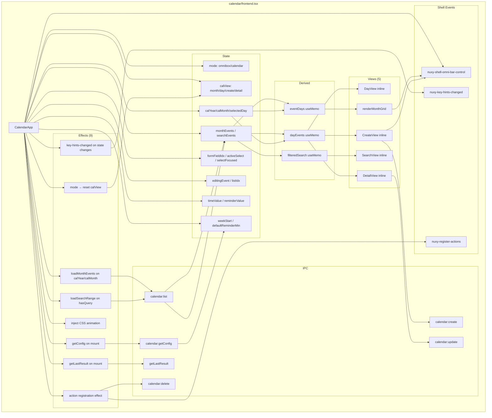

# Refactoring Assessment — Nuxy Top-8 Files

**Date:** 2026-06-02 | **Generated at:** 01:11:31  
**Analyst:** Senior Architecture Review  
**Scope:** 8 files identified as largest by line count

---

## 1. Executive Summary Table

| #   | File                                       | Lines | Responsibilities                                           | Risk   | Test Coverage        | Priority |
| --- | ------------------------------------------ | ----- | ---------------------------------------------------------- | ------ | -------------------- | -------- |
| 1   | `extensions/calendar/frontend.tsx`         | 1016  | UI views (5 modes), IPC, keyboard mgmt, state coordination | HIGH   | YES (4 test files)   | P1       |
| 2   | `extensions/shell/frontend.tsx`            | 933   | App shell, drag/resize, routing, keyboard, providers       | HIGH   | PARTIAL (utils.test) | P2       |
| 3   | `extensions/video-downloader/frontend.tsx` | 931   | Format browser, download mgmt, history, navigation         | HIGH   | NO                   | P3       |
| 4   | `extensions/settings/frontend.tsx`         | 768   | Settings CRUD, ext schemas, nav coordination               | MEDIUM | NO                   | P4       |
| 5   | `extensions/gradient/gradient.ts`          | 764   | WebGL Stripe gradient port — single cohesive class         | LOW    | NO                   | P7       |
| 6   | `extensions/clipboard/frontend.tsx`        | 728   | Clipboard list, preview panel, IPC, type detection         | MEDIUM | NO                   | P5       |
| 7   | `src/electron/extensions/scanner.ts`       | 553   | Ext scanning, extraction, security, watching               | MEDIUM | YES (scanner.test)   | P6       |
| 8   | `extensions/notes/frontend.tsx`            | 506   | Note CRUD, edit/preview modes, voice recording             | LOW    | NO                   | P8       |

---

## 2. Per-File Detailed Analysis

---

### 2.1 `extensions/calendar/frontend.tsx` — 1016 lines

#### PHASE 1 — File Metrics

- **Total lines:** 1016
- **Functions / components:** 1 export (`CalendarApp`) + 7 pure helpers + 4 render methods inline
- **Hooks used:** `useState` (14 calls), `useEffect` (9 calls), `useMemo` (3 calls), `useRef` (1), `_useToolKeyActions` (custom, 1)
- **State variables:** 17 (`mode`, `monthEnterDir`, `calYear`, `calMonth`, `selectedDay`, `calView`, `monthEvents`, `searchEvents`, `listIdx`, `editingEvent`, `weekStart`, `defaultReminderMin`, `timeValue`, `reminderValue`, `formFieldIdx`, `activeSelect`, `selectFocused`)
- **Props:** 1 (`query: string`)

#### Responsibilities

1. Renders a live calendar widget (omnibox vs. calendar modes)
2. Manages 5 distinct views: `omnibox`, `month-grid`, `day`, `create-event`, `event-detail`
3. Handles all IPC calls (load events, create, update, delete, getConfig)
4. Registers keyboard actions via `_useToolKeyActions` (12 actions)
5. Registers command-palette actions (3 types) via CustomEvent
6. Synchronises omnibar show/hide with shell
7. Injects CSS keyframe animations into the document head
8. Reacts to `getLastResult` IPC to restore navigation context

#### PHASE 2 — Code Smells

- **God component:** `CalendarApp` is 878 lines of a single function body. It owns data fetching, 5 rendered views, 12 keyboard shortcuts, 3 command-palette entries, and omnibar lifecycle.
- **Long inline render function:** `renderMonthGrid()` defined inside the component body (lines 601–745, ~145 lines). This is a JSX-returning function, not a hook, so it re-creates every render.
- **Mixed concerns:** IPC call sites (`loadMonthEvents`, `loadSearchRange`), view logic (5 render paths), and keyboard registrations all live at the same level.
- **stateRef anti-pattern:** A 15-property `stateRef` snapshot (lines 200–234) is manually kept in sync to feed stable keyboard callbacks — a classic sign the keyboard logic should be a dedicated hook.
- **Repeated `ipcCall` wrapper:** Defined locally; same pattern exists in video-downloader, notes, clipboard, etc.
- **Inline style objects:** Large style objects duplicated between create/detail views for the date-header `<div>` (lines 873–879 and 963–966 are near-identical).

#### PHASE 3 — Complexity Estimates

| Unit                            | Cyclomatic Complexity | Nesting Depth | Notes                                |
| ------------------------------- | --------------------- | ------------- | ------------------------------------ |
| `CalendarApp` (full body)       | ~45                   | 6             | Multiple if/else render paths        |
| `renderMonthGrid`               | ~12                   | 5             | onClick with nested if chains        |
| `_useToolKeyActions` call block | ~20                   | 3             | 12 action objects w/ activeOn guards |
| save-action `onExecute` handler | ~8                    | 4             | create vs. detail branching          |
| `buildGrid`                     | ~5                    | 3             | Pure, well-scoped                    |
| `useEffect` action registration | ~10                   | 4             | Multi-condition if chain             |

#### PHASE 4 — Extraction Strategy

| Extraction                                     | Target                                           | Approx. Lines Saved                       |
| ---------------------------------------------- | ------------------------------------------------ | ----------------------------------------- |
| `useCalendarData(year, month)` hook            | Load/cache month events, search range, getConfig | ~60                                       |
| `useCalendarKeyboard(stateRef, handlers)` hook | All 12 `_useToolKeyActions` entries              | ~140                                      |
| `useCalendarActions(...)` hook                 | `useEffect` command-palette registration         | ~65                                       |
| `MonthGrid` sub-component                      | `renderMonthGrid()` → proper React component     | ~145                                      |
| `DayView` sub-component                        | Day-list render path (lines 809–858)             | ~50                                       |
| `CreateView` sub-component                     | Create-event form (lines 861–950)                | ~90                                       |
| `DetailView` sub-component                     | Event detail/edit (lines 952–1013)               | ~62                                       |
| `SearchView` sub-component                     | Omnibox search results (lines 750–802)           | ~53                                       |
| `useIpc(extId)` utility                        | Shared `ipcCall` helper (present in 4+ files)    | ~10/file                                  |
| **Total**                                      |                                                  | **~665 lines → ~350 line main component** |

#### PHASE 5 — Risk Assessment

- **Refactoring risk:** HIGH — 5 distinct view states share a large mutable state bag; incorrect extraction will break mode transitions
- **Test coverage:** YES — `calendar-key-conditions.test.ts`, `calendar-utils.test.ts`, `calendar-create-form.test.ts`, `calendar-key-exclusivity.test.ts` exist; coverage is backend/util-centric, not frontend component tests
- **Breaking change risk:** Medium — extraction is additive; no external API surface changes needed

---

### 2.2 `extensions/shell/frontend.tsx` — 933 lines

#### PHASE 1 — File Metrics

- **Total lines:** 933
- **Functions / components:** 1 export (`ShellView`) + 7 local handlers
- **Hooks used:** `useState` (18 calls), `useEffect` (12 calls), `useLayoutEffect` (1), `useMemo` (1), `useRef` (8), custom hooks: `useShellInit`, `useProviders`, `useKeyboard`, `useToolHistory`
- **State variables:** 19
- **Props:** 1 (`query: string` aliased internally)

#### Responsibilities

1. Top-level app shell rendering (omnibar, tool area, shortcut bar)
2. Draggable window management (mouse drag, position clamping)
3. 8-directional window resize handles
4. Tool routing (dynamic import of extension frontends)
5. List results composition (tools + providers, deduplication)
6. Command palette (`showCommandPalette`)
7. Custom event bus listeners (reset, focus, settings-updated, omnibar-control, footer-hints, key-actions)
8. Zoom-aware positioning via `MutationObserver` on `document.documentElement`
9. Provider state aggregation for result/compare/list types

#### PHASE 2 — Code Smells

- **God component:** Even after delegation to `useShellInit`, `useProviders`, `useKeyboard`, `useToolHistory`, the main component body is 933 lines. Drag, resize, and position logic alone span ~200 lines.
- **`handleDragMouseDown`:** 43 lines with closure over position and zoom state.
- **`handleResizeMouseDown`:** 62 lines with 8-direction math inline.
- **Provider rendering duplication:** The result-provider and compare-provider `Object.keys(providerStates).filter(...)` map blocks are near-identical (lines 718–784).
- **List rendering duplication:** Two paths for list results — one using `window.UI.List` components, one falling back to raw divs (lines 787–832) — render the same items with different wrappers.
- **12 `useEffect` hooks** in the component body (several are single-line cleanup pairs that could be merged or moved into hooks).
- **`getZoom()` defined inline**, used by both drag and resize handlers; also defined inside a `useEffect` (shadowing).

#### PHASE 3 — Complexity Estimates

| Unit                    | Cyclomatic Complexity | Nesting Depth |
| ----------------------- | --------------------- | ------------- |
| `ShellView` body        | ~55                   | 7             |
| `handleDragMouseDown`   | ~8                    | 4             |
| `handleResizeMouseDown` | ~14                   | 4             |
| `handleKeyDown`         | ~12                   | 4             |
| `listResults` useMemo   | ~8                    | 4             |
| JSX return block        | ~18                   | 8             |

#### PHASE 4 — Extraction Strategy

| Extraction                                                                                   | Target                                                                                                  | Approx. Lines Saved                       |
| -------------------------------------------------------------------------------------------- | ------------------------------------------------------------------------------------------------------- | ----------------------------------------- |
| `useDragResize(containerRef, position, setPosition, size, setSize, cfgRef, hasDragged)` hook | Both drag + resize handlers, zoom calculation, position clamping                                        | ~200                                      |
| `useWindowPosition(cfgRef, hasDragged, containerRef, setPosition)` hook                      | `useEffect` for MutationObserver zoom tracking + updatePosition                                         | ~80                                       |
| `useShellEvents(...)` hook                                                                   | reset/focus/settingsUpdate/omniBarControl/footerHints/actions/keyActions event listeners (7 useEffects) | ~120                                      |
| `ProviderSection` sub-component                                                              | Shared skeleton+item rendering for result/compare providers                                             | ~70                                       |
| `ListResults` sub-component                                                                  | Dual-path list rendering (UI.List vs raw div fallback)                                                  | ~50                                       |
| `ShellFooter` sub-component                                                                  | ShortcutBar / hint rendering                                                                            | ~45                                       |
| **Total**                                                                                    |                                                                                                         | **~565 lines → ~370 line main component** |

#### PHASE 5 — Risk Assessment

- **Refactoring risk:** HIGH — drag/resize state and keyboard actions interoperate tightly; extracting `useDragResize` requires careful ref forwarding
- **Test coverage:** `utils.test.ts` covers shell utilities only; no component-level tests
- **Breaking change risk:** Low — all changes are internal to the component

---

### 2.3 `extensions/video-downloader/frontend.tsx` — 931 lines

#### PHASE 1 — File Metrics

- **Total lines:** 931
- **Functions / components:** 1 export (`VideoDownloader`) + 4 pure helpers + 1 `_useTwoPanelNav` import
- **Hooks used:** `useState` (10 calls), `useEffect` (6 calls), `useMemo` (4 calls), `useRef` (2), custom `_useTwoPanelNav` (1)
- **State variables:** 10

#### Responsibilities

1. yt-dlp installation check
2. Video metadata fetching (on Enter in omnibar)
3. Format filtering (5 tabs: recommended, video+audio, audio-only, video-only, all)
4. Download queue management with 1-second polling
5. Download history merging into `combinedList`
6. Two-panel navigation (left tab bar, right format/download list)
7. Keyboard actions (6 custom actions in `rightPanelActions`)
8. Command-palette action registration (tab filters)
9. Footer hints (active tab label + format count)

#### PHASE 2 — Code Smells

- **`fullScreenDownloadsView`:** 75-line JSX block assigned to a `const`, not a component. It captures from outer scope and re-renders unnecessarily.
- **`rightPanelActions` useMemo:** 120 lines of action objects with stateRef reads and conditional branching; navigation callbacks (`nav.goToSection`, `nav.setFocusArea`) are called inside a `useMemo` whose deps array is empty `[]` — stale-closure risk commented with `// eslint-disable-next-line`.
- **`combinedList` useMemo:** Two nested loops with mutation of job-vs-history merging; could be a pure utility.
- **`getVideoAndAudioFormats` / `getRecommendedFormats`:** 50 lines total, well-scoped, but share a `ht()` height-parsing lambda that is redefined in each function.
- **Download polling interval:** `pollRef`-based manual polling (lines 226–241); no AbstactSignal cleanup on unmount edge cases.
- **`metaCard` and `formatList` and `left`/`right` and `fullScreenDownloadsView`:** All large JSX const blocks in render scope — effectively inline sub-renders without the performance benefits of memoization.

#### PHASE 3 — Complexity Estimates

| Unit                                  | Cyclomatic Complexity | Nesting Depth |
| ------------------------------------- | --------------------- | ------------- |
| `VideoDownloader` body                | ~40                   | 6             |
| `rightPanelActions` handler for Enter | ~10                   | 4             |
| `getRecommendedFormats`               | ~8                    | 3             |
| `combinedList` useMemo                | ~6                    | 3             |
| `filteredFormats` useMemo             | ~7 (switch)           | 2             |

#### PHASE 4 — Extraction Strategy

| Extraction                                 | Target                                                 | Approx. Lines Saved                       |
| ------------------------------------------ | ------------------------------------------------------ | ----------------------------------------- |
| `useDownloadQueue(extId)` hook             | jobs state, pollRef interval, cancelJob, startDownload | ~120                                      |
| `useVideoFormats(extId)` hook              | metadata, loading, error, getFormats, filteredFormats  | ~80                                       |
| `DownloadsView` sub-component              | `fullScreenDownloadsView` block → proper component     | ~75                                       |
| `FormatListItem` sub-component             | Format row rendering with badge logic                  | ~40                                       |
| `parseCombinedList(jobs, history)` utility | Pure merge+sort function                               | ~45                                       |
| `getVideoHeight(res)` utility              | Extract shared `ht()` lambda from two format functions | ~8                                        |
| **Total**                                  |                                                        | **~368 lines → ~563 line main component** |

#### PHASE 5 — Risk Assessment

- **Refactoring risk:** HIGH — `rightPanelActions` has a known stale-closure suppression; extraction must resolve this properly
- **Test coverage:** `backend.test.ts` only — no frontend tests
- **Breaking change risk:** Low

---

### 2.4 `extensions/settings/frontend.tsx` — 768 lines

#### PHASE 1 — File Metrics

- **Total lines:** 768
- **Functions / components:** 1 export (`SettingsView`) + 2 builder functions
- **Hooks used:** `useState` (7 calls), `useEffect` (1 large call), `useMemo` (6 calls), `useRef` (3)
- **State variables:** 7

#### Responsibilities

1. Fetches and renders Nuxy core settings (theme, zoom, font, window, etc.)
2. Fetches and renders extension settings schemas dynamically
3. Language slot management (3 ordered slots with deduplication)
4. Two-panel navigation via `_useTwoPanelNav`
5. `applySettings` side effects (zoom/font/theme) on setting change
6. `updateSetting` / `updateLanguageSlot` / `updateExtSetting` IPC writes
7. `rightPanelActions` keyboard navigation (3 actions)

#### PHASE 2 — Code Smells

- **Single massive `useEffect`:** The entire data loading block (lines 550–618, ~68 lines) loads themes, icon packs, fonts, settings, and ALL extension settings schemas in one effect. Any failure in one silently swallows errors.
- **`right` panel JSX const:** 130-line inline JSX block with 5 levels of nesting and complex conditional per-row rendering (isLanguageRow vs isExtension vs base row vs select vs input).
- **Triple-dispatch `updateSetting`:** Each update dispatches a CustomEvent, calls IPC, and calls applySettings — the cascade is implicit and hard to trace.
- **`navRef` workaround:** `const navRef = useRef(null)` then `navRef.current = nav` to break a circular reference between `nav` hook call and `rightPanelActions` useMemo — signals architectural coupling.
- **Constants at module scope:** 10 `*_OPTIONS` arrays at the top (115 lines); LANGUAGE_OPTIONS alone is 38 entries.

#### PHASE 3 — Complexity Estimates

| Unit                              | Cyclomatic Complexity | Nesting Depth |
| --------------------------------- | --------------------- | ------------- |
| `SettingsView` body               | ~30                   | 5             |
| `right` panel JSX                 | ~18                   | 6             |
| `rightPanelActions` Enter handler | ~12                   | 5             |
| data-load `useEffect`             | ~8                    | 4             |
| `updateSetting`                   | ~4                    | 2             |

#### PHASE 4 — Extraction Strategy

| Extraction                                      | Target                                                             | Approx. Lines Saved                       |
| ----------------------------------------------- | ------------------------------------------------------------------ | ----------------------------------------- |
| `useSettingsData(extId)` hook                   | All 68-line load useEffect, settings/extSchemas/themes/fonts state | ~100                                      |
| `SettingsRow` sub-component                     | Per-row rendering logic (SelectBox vs Input, lang vs ext vs base)  | ~80                                       |
| `SettingsSection` sub-component                 | SectionHeader + List + SettingsRow mapping                         | ~50                                       |
| Move options constants to `settings-options.ts` | 10 `*_OPTIONS` arrays + LANGUAGE_OPTIONS                           | ~120 lines from this file                 |
| **Total**                                       |                                                                    | **~350 lines → ~420 line main component** |

#### PHASE 5 — Risk Assessment

- **Refactoring risk:** MEDIUM — well-structured data model; key risk is `navRef` circular coupling during extraction
- **Test coverage:** `backend.test.ts` only
- **Breaking change risk:** Low

---

### 2.5 `extensions/gradient/gradient.ts` — 764 lines

#### PHASE 1 — File Metrics

- **Total lines:** 764
- **Classes:** 2 (`MiniGl`, `Gradient`)
- **Methods:** ~25 across both classes
- **Exports:** `{ Gradient }`

#### Responsibilities

1. WebGL context management (`MiniGl` class: Material, Uniform, PlaneGeometry, Mesh, Attribute inner classes)
2. GLSL shader strings (vertex, noise, blend, fragment) stored inline as template literals
3. Stripe-style animated gradient rendering
4. CSS variable polling for gradient colors (`waitForCssVars` / `initGradientColors`)
5. Animation loop (`animate`, `shouldSkipFrame`)
6. Scroll and mouse event handling (disabled/commented out)

#### PHASE 2 — Code Smells

- **This is a vendored third-party file** (`// All Credits to Stripe.com`). It carries a `// @ts-nocheck` pragma and is a direct port of the Stripe gradient animation. The unusual comma-expression style (`((a = 1), (b = 2))`) is intentional minification artifact from the original source.
- **Shader strings inline:** The four GLSL shaders (vertex, noise, blend, fragment) are ~200 lines of multi-line string literals embedded in the `connect()` method. In a real refactor these would be `.glsl` files.
- **`MiniGl` class has 5 inner class definitions** via `Object.defineProperties`, each with constructor and methods — difficult to read but functions correctly.
- **No TypeScript types** (ts-nocheck).

#### PHASE 3 — Complexity Estimates

| Unit                       | Cyclomatic Complexity | Nesting Depth     |
| -------------------------- | --------------------- | ----------------- |
| `MiniGl` constructor       | ~8                    | 5 (inner classes) |
| `Gradient.connect()`       | ~5                    | 3                 |
| `Gradient.animate()`       | ~6                    | 3                 |
| `Uniform.attachUniforms()` | ~6                    | 4                 |

#### PHASE 4 — Extraction Strategy

| Extraction              | Target                                              | Approx. Lines Saved |
| ----------------------- | --------------------------------------------------- | ------------------- |
| `shaders/vertex.glsl`   | Extract vertex shader string                        | ~30                 |
| `shaders/noise.glsl`    | Extract noise GLSL                                  | ~80                 |
| `shaders/blend.glsl`    | Extract blend GLSL                                  | ~100                |
| `shaders/fragment.glsl` | Extract fragment GLSL                               | ~10                 |
| `mini-gl.ts`            | Extract `MiniGl` class with proper TypeScript types | ~350                |

**CAVEAT:** This is a vendored file. Any refactoring breaks the implicit "do not modify vendor code" contract and introduces maintenance burden when upstream updates occur. Extraction of shaders is lower risk than splitting classes.

#### PHASE 5 — Risk Assessment

- **Refactoring risk:** LOW for functionality — the class is self-contained; MEDIUM for maintenance if upstream changes
- **Test coverage:** NO tests
- **Breaking change risk:** Low (single export used by `extensions/gradient/frontend.tsx`)

---

### 2.6 `extensions/clipboard/frontend.tsx` — 728 lines

#### PHASE 1 — File Metrics

- **Total lines:** 728
- **Functions / components:** 1 export (`ClipboardView`) + 6 helpers + 2 sub-components (`FileIconFor`, `ClipboardItemLeading`)
- **Hooks used:** `useState` (4 calls), `useEffect` (5 calls), `useMemo` (1), `_useToolKeyActions` (1)
- **State variables:** 4

#### Responsibilities

1. Clipboard history polling (1500ms interval)
2. Search/filter items
3. Item type detection (image, color, url, file, text)
4. Left panel: list rendering with type-aware icons and labels
5. Right panel: type-aware preview (image, color swatch, text) with properties
6. IPC: copy, copyFile, pin, unpin, delete
7. Keyboard actions (3: navigate up/down, copy on Enter)
8. Command-palette actions (delete, pin/unpin)

#### PHASE 2 — Code Smells

- **Duplicated properties panel:** The `rightPanel` contains TWO full implementations of the properties panel (lines 561–598 using `PropertiesPanel` and lines 599–659 as a raw `<div>` fallback). Both are ~60 lines and render the same data — one is a duplicate guard for missing `window.UI.PropertiesPanel`.
- **`handleCopy` / `handleCopyFile`:** 20 lines each, near-identical bodies (invoke different channels, then same post-copy logic: set items, setCopiedId, auto-hide). A single `handleCopyItem(id, channel)` would eliminate ~20 lines.
- **`handlePin` / `handleUnpin`:** Near-identical IPC handlers.
- **`rightPanel` is a 265-line inline const** — the largest in the codebase outside `shell/frontend.tsx`. It is an IIFE `(() => { ... })()` which is unusual React pattern.
- **`timeAgo` defined inline** — pure utility; should be module-level.

#### PHASE 3 — Complexity Estimates

| Unit                 | Cyclomatic Complexity | Nesting Depth |
| -------------------- | --------------------- | ------------- |
| `ClipboardView` body | ~20                   | 4             |
| `rightPanel` JSX     | ~12                   | 6             |
| `getItemType`        | ~8                    | 2             |
| `handleDelete`       | ~5                    | 3             |

#### PHASE 4 — Extraction Strategy

| Extraction                                            | Target                                              | Approx. Lines Saved                       |
| ----------------------------------------------------- | --------------------------------------------------- | ----------------------------------------- |
| `ClipboardPreview` sub-component                      | rightPanel preview area (image/color/text branches) | ~90                                       |
| `ClipboardProperties` sub-component                   | properties section with PropertiesPanel fallback    | ~100                                      |
| `useClipboardActions(items, selectedIndex, ...)` hook | IPC handlers: copy/copyFile/pin/unpin/delete        | ~120                                      |
| `timeAgo(dateString)` → module-level                  | Extract from inside component                       | ~10                                       |
| Merge `handleCopy`+`handleCopyFile`                   | Single parameterized handler                        | ~20                                       |
| Merge `handlePin`+`handleUnpin`                       | Single parameterized handler                        | ~20                                       |
| **Total**                                             |                                                     | **~360 lines → ~370 line main component** |

#### PHASE 5 — Risk Assessment

- **Refactoring risk:** MEDIUM — interval polling and IPC handlers interact with stale-closure risks
- **Test coverage:** `backend.test.ts` only — no frontend tests
- **Breaking change risk:** Low

---

### 2.7 `src/electron/extensions/scanner.ts` — 553 lines

#### PHASE 1 — File Metrics

- **Total lines:** 553
- **Functions:** 9 exported/local functions
- **Hooks:** None (Node.js module)
- **Imports:** 14 (fs, path, module, electron, 4 internal modules, 4 security modules, logger, adm-zip, @nuxy/core types)

#### Responsibilities

1. `detectNodeImports(code)` — regex-based AST-lite import scanner
2. `scanDirectoryForNodeImports(dir)` — recursive file walker for security checks
3. `rescanExtensions()` — teardown + rescan orchestrator
4. `clearWatchers()` / `startExtensionWatcher()` — dev-mode fs.watch management
5. `promptTrustPublisherKey(extensionId, pem)` — Electron dialog for first-time publisher approval
6. `scanExtensions()` — main 290-line function: extract .nuxyext/dir, verify signatures, check revocation, trust publisher, load manifest, register theme/iconpack/uikit/helper/backend, load settings schema, validate locales

#### PHASE 2 — Code Smells

- **`scanExtensions()` is 290 lines** (lines 239–553) in a single function. It performs extraction (phases 1–4 per item), manifest loading, permission validation, type-dispatch, settings schema loading, and locale verification in a nested `for` loop.
- **Extract-then-register coupling:** The first loop (extraction) and the second loop (manifest loading) both iterate over the extension directory. The extraction phase tracks `activeFolders` and then re-reads `EXTRACTED_DIR` in the second pass. This is correct but hard to follow.
- **`restoreWritable` inner function at line 364:** Defined inline within a `for` loop body. A module-level utility would be cleaner.
- **Type-dispatch `if/else if` chain:** Lines 460–509 — 8 branches for `manifest.type` values. A strategy map would reduce cognitive load.
- **`promptTrustPublisherKey`:** Synchronous Electron dialog in an async function. Correctly handled, but mixing sync blocking dialog with async context is a smell.

#### PHASE 3 — Complexity Estimates

| Unit                              | Cyclomatic Complexity | Nesting Depth |
| --------------------------------- | --------------------- | ------------- |
| `scanExtensions()`                | ~25                   | 6             |
| `scanDirectoryForNodeImports`     | ~10                   | 5             |
| `detectNodeImports`               | ~8                    | 3             |
| Type-dispatch in `scanExtensions` | ~10 (if chain)        | 3             |

#### PHASE 4 — Extraction Strategy

| Extraction                                       | Target                                                           | Approx. Lines Saved                                                |
| ------------------------------------------------ | ---------------------------------------------------------------- | ------------------------------------------------------------------ |
| `extractExtensionItem(itemName, ...)` function   | Per-item extraction logic (lines 277–388)                        | ~110                                                               |
| `loadExtensionFromDir(folderName, ...)` function | Manifest load + type dispatch + schema + locales (lines 409–548) | ~140                                                               |
| `restoreWritable(path)` → module-level           | Move inner function to top of file                               | ~10                                                                |
| Type-dispatch strategy map `TYPE_HANDLERS`       | Replace 8-branch if/else with `Record<string, handler>`          | ~40                                                                |
| **Total**                                        |                                                                  | **~300 lines → ~253 line main scanExtensions + 2 focused helpers** |

#### PHASE 5 — Risk Assessment

- **Refactoring risk:** MEDIUM — security-critical code; extraction must not introduce re-ordering of security checks
- **Test coverage:** YES — `scanner.test.ts` exists
- **Breaking change risk:** Medium — internal to main process; no API surface change

---

### 2.8 `extensions/notes/frontend.tsx` — 506 lines

#### PHASE 1 — File Metrics

- **Total lines:** 506
- **Functions / components:** 1 export (`NotesApp`) + 1 helper (`deriveTitle`) + 1 class (`ErrorBoundary`)
- **Hooks used:** `useState` (6 calls), `useEffect` (7 calls), `useMemo` (1), `useRef` (2), `_useToolKeyActions` (1)
- **State variables:** 6 (+2 media-recording states)

#### Responsibilities

1. Note list (filtered by query)
2. Note CRUD via IPC
3. Two-panel layout: list (left) + editor/preview (right)
4. Edit mode (Textarea) / view mode (MarkdownText)
5. Voice recording → transcription via backend
6. Keyboard actions (7: new, save, delete, edit, escape, up/down)
7. Command-palette actions (new, save, delete, record/stop)
8. Select: query handling (from search provider clicks)
9. `ErrorBoundary` class wrapping MarkdownText renders

#### PHASE 2 — Code Smells

- **`handleSave` duplicates filter logic:** Lines 182–190 re-implement the filteredNotes logic from the `useMemo` to find the new index — should reuse memo or accept as parameter.
- **`handleRecord` is 30 lines inline:** Includes navigator.mediaDevices, MediaRecorder setup, blob conversion, IPC transcription — could be a `useAudioRecording` hook.
- **`keyActions` useMemo deps too broad:** `[editMode, selectedIndex, filteredNotes, selected, body]` — body changes on every keystroke, causing keyActions to rememoize constantly during editing.
- **`console.log('[DEBUG]...')` at line 276:** Leftover debug statement in production code.
- **`invoke` helper defined inside component:** The generic `invoke<T>` helper is defined inline but is functionally identical to the pattern in calendar, clipboard, and notes backends.
- **CSS injection via `<style>` tag in JSX** (lines 494–498): The `.nuxy-notes-edit-mode` style is injected inline — should be a dedicated CSS file or CSS module.

#### PHASE 3 — Complexity Estimates

| Unit                 | Cyclomatic Complexity | Nesting Depth |
| -------------------- | --------------------- | ------------- |
| `NotesApp` body      | ~18                   | 4             |
| `handleRecord`       | ~8                    | 4             |
| `handleSave`         | ~7                    | 3             |
| `keyActions` useMemo | ~10                   | 3             |

#### PHASE 4 — Extraction Strategy

| Extraction                       | Target                                                                       | Approx. Lines Saved                       |
| -------------------------------- | ---------------------------------------------------------------------------- | ----------------------------------------- |
| `useAudioRecording(invoke)` hook | handleRecord, handleStopRecord, recording, transcribing, mediaRef, chunksRef | ~55                                       |
| `NoteEditor` sub-component       | rightPanel edit mode (Textarea wrapper)                                      | ~30                                       |
| `NotePreview` sub-component      | rightPanel preview mode (title + MarkdownText + ErrorBoundary)               | ~20                                       |
| Fix `keyActions` deps            | Remove `body` from deps; use ref for body inside handler                     | ~0 lines, performance fix                 |
| Remove debug `console.log`       | Line 276                                                                     | 1 line                                    |
| Move CSS to file or CSS var      | `<style>` tag at render root                                                 | ~5                                        |
| **Total**                        |                                                                              | **~110 lines → ~396 line main component** |

#### PHASE 5 — Risk Assessment

- **Refactoring risk:** LOW — clean data flow, limited cross-state coupling
- **Test coverage:** `backend.test.ts` only; no frontend component tests
- **Breaking change risk:** Low

---

## 3. Dependency Graph — Most Complex File (calendar/frontend.tsx)



**ASCII version for non-Mermaid environments:**

```
CalendarApp
├─ STATE (17 vars)
│   ├─ mode / calView ──────────────┐
│   ├─ calYear/calMonth/selectedDay  │
│   ├─ monthEvents/searchEvents ────►─── DERIVED ──► dayEvents, filteredSearch, eventDays
│   └─ formFieldIdx/activeSelect/...
│
├─ EFFECTS (9)
│   ├─ [mount]       → IPC: getConfig → setWeekStart, setDefaultReminderMin
│   ├─ [year/month]  → IPC: calendar:list → setMonthEvents
│   ├─ [hasQuery]    → IPC: calendar:list → setSearchEvents
│   ├─ [mode]        → reset calView
│   ├─ [mount]       → inject CSS keyframes into <head>
│   ├─ [mount]       → IPC: getLastResult → may set mode/calView/create form
│   ├─ [many states] → CustomEvent: nuxy-key-hints-changed
│   └─ [many states] → CustomEvent: nuxy-register-actions (new/delete/save)
│
├─ KEYBOARD (12 actions via _useToolKeyActions)
│   └─ reads from stateRef.current (snapshot of all 17 state vars)
│
└─ VIEWS (render-time branching)
    ├─ isSearching     → SearchView (inline, ~53 lines)
    ├─ omnibox/month   → renderMonthGrid() (~145 lines, function-in-component)
    ├─ day             → DayView (inline, ~50 lines)
    ├─ create          → CreateView (inline, ~90 lines)
    └─ detail          → DetailView (inline, ~62 lines)
```

---

## 4. Prioritized Execution Roadmap

### Tier 1 — Immediate (High Impact, High Complexity)

#### P1: `calendar/frontend.tsx` — Week 1

**Why first:** Largest file (1016 lines), 5 views, 9 effects, 17 state vars, has the most test scaffolding to work against.  
**Order of operations:**

1. Extract pure helpers to `calendar-utils.ts` (already partially done per `calendar-utils.ts` presence)
2. Extract `useCalendarData` hook (IPC calls, loadMonthEvents, loadSearchRange, getConfig)
3. Extract `useCalendarKeyboard` hook (all 12 key actions + stateRef pattern)
4. Extract `useCalendarActions` hook (command-palette useEffect)
5. Extract view sub-components: `MonthGrid` → `DayView` → `CreateEventView` → `EventDetailView` → `SearchView`
6. Run all 4 calendar test files; add frontend rendering smoke tests
   **Estimated result:** ~350 lines in main component, ~650 lines in 6 new files

#### P2: `shell/frontend.tsx` — Week 2

**Why second:** App shell; any regression is immediately visible. Good existing hook decomposition (`useShellInit`, etc.) to follow as a pattern.  
**Order of operations:**

1. Extract `useDragResize` hook (drag + resize + getZoom)
2. Extract `useWindowPosition` hook (MutationObserver + updatePosition)
3. Extract `useShellEvents` hook (7 event-listener effects)
4. Extract `ProviderSection`, `ListResults`, `ShellFooter` sub-components
5. Verify visually (no test suite covers component rendering)
   **Estimated result:** ~370 lines in main component

### Tier 2 — Near-Term (Medium Impact)

#### P3: `video-downloader/frontend.tsx` — Week 3

1. Extract `useDownloadQueue` hook
2. Extract `useVideoFormats` hook
3. Extract `DownloadsView`, `FormatListItem` components
4. Extract `parseCombinedList` utility and `getVideoHeight` utility
5. Fix stale-closure in `rightPanelActions` (remove `// eslint-disable-next-line`)

#### P4: `settings/frontend.tsx` — Week 3

1. Move all `*_OPTIONS` constants to `settings-options.ts`
2. Extract `useSettingsData` hook
3. Extract `SettingsRow` and `SettingsSection` sub-components
4. Resolve the `navRef` circular reference architecturally

### Tier 3 — Opportunistic (Lower Risk)

#### P5: `clipboard/frontend.tsx` — Week 4

1. Merge `handleCopy`/`handleCopyFile` and `handlePin`/`handleUnpin`
2. Extract `ClipboardPreview` component
3. Extract `ClipboardProperties` component (eliminates duplication)
4. Extract `useClipboardActions` hook
5. Move `timeAgo` to module level

#### P6: `scanner.ts` — Week 4

1. Extract `extractExtensionItem(itemName, itemPath, ...)` function
2. Extract `loadExtensionFromDir(folderName, ...)` function
3. Replace type-dispatch if/else with strategy map
4. Move `restoreWritable` to module scope
5. Run `scanner.test.ts` after each step

#### P7: `gradient/gradient.ts` — Optional / Backlog

- This is vendored code with `@ts-nocheck`. Refactoring is cosmetic only.
- If time permits: extract GLSL to separate `.glsl` files and import as strings
- Add `// NOTE: Vendored from Stripe/Kevin Hufnagl, do not refactor` header to prevent future churn

#### P8: `notes/frontend.tsx` — Week 5

1. Remove `console.log('[DEBUG]...')` at line 276 (immediate)
2. Extract `useAudioRecording` hook
3. Extract `NoteEditor` / `NotePreview` sub-components
4. Fix `keyActions` useMemo deps to exclude `body`
5. Move inline `<style>` tag to `notes.css`

---

## 5. Shared Cross-Cutting Concerns

### 5.1 `ipcCall` / `invoke` Utility Pattern

All 4 extension frontends (calendar, notes, clipboard, video-downloader) define their own local IPC helper with the same shape:

```typescript
// Calendar:
function ipcCall(channel, payload) { return window.core.ipc.invoke(EXT_ID, channel, payload).then(r => { if (!r?.success) throw... return r.data }) }
// Notes:
const invoke = <T>(channel, payload?) => window.core.ipc.invoke(EXT_ID, channel, payload).then(r => { ... })
// Clipboard: same pattern, no local helper
// Video-downloader: async function ipc<T>(channel, payload?) { ... }
```

**Recommendation:** Provide a `createIpcClient(extId: string)` factory in `@nuxy/extension-sdk` that returns a typed `invoke<T>()` helper. This eliminates 6–10 lines per extension and unifies error handling.

### 5.2 `stateRef` Snapshot Pattern

Calendar, video-downloader, and settings all use a manually-maintained `stateRef.current = { ...allState }` to feed stable keyboard callbacks. This is valid for avoiding stale closures with `useToolKeyActions`, but it is verbose and error-prone (easy to omit a new state variable). A shared `useStableRef(state)` hook that returns the ref would reduce boilerplate.

### 5.3 `nuxy-register-actions` + `nuxy-key-hints-changed` Lifecycle

5 of 8 files dispatch these events. The pattern is identical in all of them. This could be abstracted into `useCommandPalette(actions)` and `useKeyHints()` hooks in `@nuxy/extension-sdk`.

---

## 6. TodoWrite-Compatible Task Checklist

```markdown
## Refactor: calendar/frontend.tsx

- [ ] Extract `useCalendarData` hook (IPC calls + state)
- [ ] Extract `useCalendarKeyboard` hook (12 actions + stateRef)
- [ ] Extract `useCalendarActions` hook (command palette useEffect)
- [ ] Extract `MonthGrid` sub-component from `renderMonthGrid()`
- [ ] Extract `DayView` sub-component
- [ ] Extract `CreateEventView` sub-component
- [ ] Extract `EventDetailView` sub-component
- [ ] Extract `SearchView` sub-component
- [ ] Write frontend smoke tests using @playwright/test
- [ ] Verify all 4 calendar test files still pass

## Refactor: shell/frontend.tsx

- [ ] Extract `useDragResize` hook (drag + resize + getZoom)
- [ ] Extract `useWindowPosition` hook (MutationObserver + updatePosition)
- [ ] Extract `useShellEvents` hook (7 event-listener useEffects)
- [ ] Extract `ProviderSection` sub-component (result + compare providers)
- [ ] Extract `ListResults` sub-component (dual-path list rendering)
- [ ] Extract `ShellFooter` sub-component
- [ ] Verify via manual UI test (pnpm dev)

## Refactor: video-downloader/frontend.tsx

- [ ] Extract `useDownloadQueue` hook (jobs + polling + cancel)
- [ ] Extract `useVideoFormats` hook (metadata + filtered formats)
- [ ] Extract `DownloadsView` sub-component
- [ ] Extract `FormatListItem` sub-component
- [ ] Extract `parseCombinedList(jobs, history)` utility
- [ ] Extract `getVideoHeight(resolution)` shared utility
- [ ] Resolve stale-closure in rightPanelActions (remove eslint-disable)
- [ ] Write backend.test.ts for queue polling edge cases

## Refactor: settings/frontend.tsx

- [ ] Move \*\_OPTIONS constants to settings-options.ts
- [ ] Extract `useSettingsData` hook
- [ ] Extract `SettingsRow` sub-component
- [ ] Extract `SettingsSection` sub-component
- [ ] Resolve `navRef` circular reference

## Refactor: clipboard/frontend.tsx

- [ ] Merge handleCopy + handleCopyFile into parameterized handler
- [ ] Merge handlePin + handleUnpin into parameterized handler
- [ ] Extract `ClipboardPreview` sub-component
- [ ] Extract `ClipboardProperties` sub-component (removes duplication)
- [ ] Extract `useClipboardActions` hook
- [ ] Move `timeAgo` to module scope

## Refactor: scanner.ts

- [ ] Extract `extractExtensionItem()` function
- [ ] Extract `loadExtensionFromDir()` function
- [ ] Replace type-dispatch if/else with strategy map object
- [ ] Move `restoreWritable()` to module scope
- [ ] Run scanner.test.ts and verify all pass

## Refactor: notes/frontend.tsx

- [ ] IMMEDIATE: Remove console.log('[DEBUG]...') at line 276
- [ ] Extract `useAudioRecording` hook
- [ ] Extract `NoteEditor` sub-component
- [ ] Extract `NotePreview` sub-component
- [ ] Fix keyActions useMemo to not depend on `body`
- [ ] Move inline <style> tag to notes.css

## Refactor: gradient/gradient.ts (Optional)

- [ ] Add vendor attribution header comment
- [ ] Extract GLSL strings to shaders/\*.glsl files (import as strings)

## Cross-Cutting

- [ ] Add `createIpcClient(extId)` factory to @nuxy/extension-sdk
- [ ] Add `useStableRef(state)` hook to @nuxy/extension-sdk
- [ ] Add `useCommandPalette(actions, deps)` hook to @nuxy/extension-sdk
- [ ] Add `useKeyHints()` hook to @nuxy/extension-sdk
```

---

## Appendix: Files with No Frontend Test Coverage

The following files have no `*.test.tsx` / `*.test.ts` covering component-level rendering:

- `extensions/shell/frontend.tsx` — only `utils.test.ts`
- `extensions/video-downloader/frontend.tsx` — only `backend.test.ts`
- `extensions/settings/frontend.tsx` — only `backend.test.ts`
- `extensions/gradient/gradient.ts` — no tests
- `extensions/clipboard/frontend.tsx` — only `backend.test.ts`
- `extensions/notes/frontend.tsx` — only `backend.test.ts`

Given the Nuxy architecture (extensions run in a frameless Electron window, `window.React` / `window.UI` injected at runtime), frontend component tests require either:

- Playwright full-UI tests using the `electronApp`/`appPage` fixtures in `src/e2e/`
- Unit-style tests with a mock `window.React` / `window.UI` bridge (achievable with vitest + jsdom and manual stubs)

**Recommendation:** Before any refactoring, add at least one smoke-test per frontend extension using Playwright to catch regressions.
