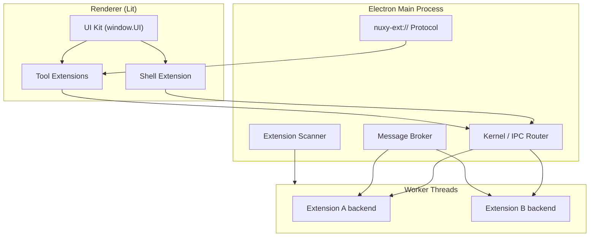

# Architecture Map

A high-level map of how Nuxy fits together. Use this page to orient yourself before diving into individual topics.

## Layers

### Kernel (`src/electron/`)

The main process with OS access. Validates permissions, routes IPC, manages the window, and serves extension assets. Extensions never touch Electron directly.

→ [System Architecture](/design/system-architecture) · [Modules](/design/modules)

### Worker threads

One isolated Node.js Worker per extension backend. No shared memory, no direct `require('fs')`. Communication via `CoreContext` proxy over `MessagePort`.

→ [Plugin System](/design/modular-plugin-system) · [Security](/design/security)

### Renderer (`src/renderer/`)

Lit-based bootstrap. Loads the UI kit, applies theme tokens, mounts the shell extension. Tool UIs are `nuxy-tool-*` custom elements loaded on demand.

→ [Frontend Extensions](/design/frontend-extensions) · [Lit Renderer](/design/lit-renderer)

## Data paths

| Flow                  | Path                                                          |
| --------------------- | ------------------------------------------------------------- |
| User types in omnibar | Shell → `core.ipc.invoke` → provider Workers → results list   |
| User activates a tool | Shell → `nuxy-ext://` loads frontend → Lit element mounts     |
| Extension stores data | Worker → `core.storage.write` → chrooted `~/.nuxy/data/<id>/` |
| Cross-extension call  | Worker A → `core.extensions.invoke` → broker → Worker B       |

→ [Data Flow](/design/data-flow) · [API Design](/design/api-design)

## Key runtime paths

| Path                  | Purpose                        |
| --------------------- | ------------------------------ |
| `~/.nuxy/nuxyconfig`  | User settings                  |
| `~/.nuxy/extensions/` | Installed extensions           |
| `~/.nuxy/data/<id>/`  | Per-extension storage (chroot) |
| `~/.nuxy/themes/`     | Theme JSON files               |
| `/tmp/nuxy.sock`      | Toggle/show commands           |
