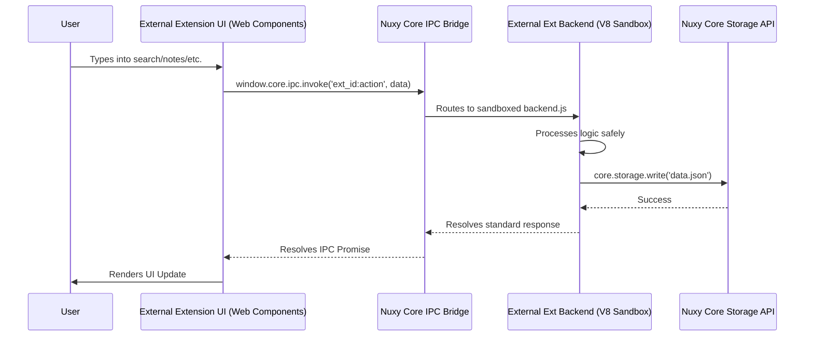

# Data Flow

## 1. Unidirectional Data across Boundaries

Because Nuxy is an Empty Shell acting as a router, the data flow occurs between the user's downloaded custom element UI (running in the Chromium Renderer) and the user's downloaded Backend Node.js code (running in the V8 Sandbox). The Nuxy kernel only acts as the bridge.

## 2. Real-Time Event Streams

For push-based updates (e.g., a background monitor pushing state to its frontend), the planned flow uses `core.ipc.broadcast` from the backend and `window.core.ipc.on` in the frontend. This API is not yet implemented — frontends currently poll via `setInterval` or re-fetch on `query` changes.

---

**See also:** [Modules](/design/modules) · [IPC & Kernel](/guide/ipc-kernel) · [System Architecture](/design/system-architecture)
