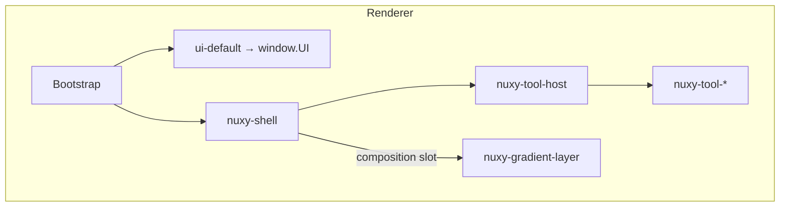

# Lit Renderer

How Nuxy mounts extension UIs securely using Lit custom elements, a tool host, and a composition layer.

::: info Current architecture
Nuxy uses a **Lit-based renderer**. Tool extensions export `nuxy-tool-*` custom elements loaded via `nuxy-ext://`. There is no React runtime in the shell.
:::

## Tool host (`<nuxy-tool-host>`)

When the user activates a tool, the shell:

1. Reads `manifest.entry.element` (e.g. `nuxy-tool-notes`)
2. Dynamically imports `nuxy-ext://<id>/frontend.ts`
3. Creates the custom element and mounts it inside `<nuxy-tool-host>`
4. Forwards omnibar input via the `query` **property** (not attribute — avoids serialization cost on every keystroke)

```typescript
// Shell sets properties on the active tool element
toolElement.query = omnibarValue
toolElement.extensionId = activeToolId
toolElement.committedQuery = committedValue
```

Every tool element implements `NuxyToolElement` from `@nuxy/core`:

| Property / method      | Role                                           |
| ---------------------- | ---------------------------------------------- |
| `query`                | Live omnibar text — updated on every keystroke |
| `committedQuery`       | Value after Enter                              |
| `extensionId`          | Manifest ID for IPC calls                      |
| `connectedCallback`    | Load data, start controller                    |
| `disconnectedCallback` | Cleanup listeners                              |

## Light DOM

Tool elements use **light DOM** (`createRenderRoot() { return this }`) so theme CSS custom properties from `document.documentElement` apply. Shadow DOM would block theme tokens.

UIKit components from `window.UI` render inside the tool's light DOM tree.

## Composition layer (`core.composition`)

Helper extensions like `com.nuxy.gradient` attach overlays without querying shell internals. They claim named slots declared in their manifest:

| Slot               | Typical use                  |
| ------------------ | ---------------------------- |
| `background-layer` | Ambient gradient, wallpaper  |
| `footer-portal`    | Footer hints, status widgets |
| `omnibar-portal`   | Omnibar adornments           |

```typescript
// Helper extension frontend (simplified)
const handle = await window.core.composition.mount('background-layer', 'nuxy-gradient-layer')
window.core.composition.setState(handle, { opacity: 0.6 })
```

The kernel validates slot claims against `manifest.composition.claims` before allowing a mount. Extensions cannot `document.querySelector` into the shell.

## Architecture



## Authoring a tool frontend

```
extensions/my-tool/
  manifest.json          # entry.element: "nuxy-tool-my-tool"
  frontend.ts            # import './nuxy-tool-my-tool.ts'
  nuxy-tool-my-tool.ts   # LitElement + NuxyToolElement
  controller.ts          # state + IPC
```

See [Frontend Structure](/extensions/frontend-structure) and [Your First Extension](/extensions/first-extension) for the full pattern.

## Related

- [Frontend Extensions](/design/frontend-extensions) — UI kit and canvas zones
- [Omni Input System](/design/omni-input-system) — how query flows to tools and providers
- [Security](/design/security) — why cross-extension DOM access is blocked
