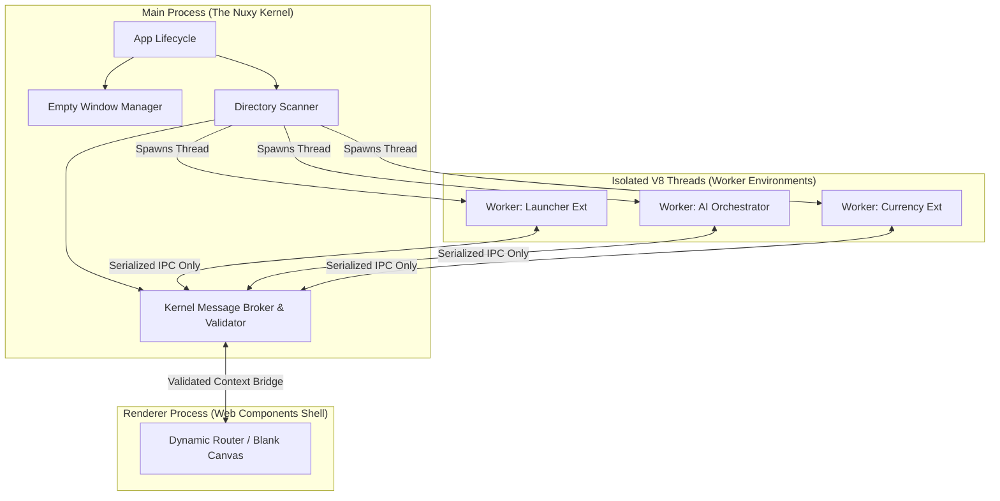

# System Architecture

## 1. High-Level Architectural Paradigm

Nuxy is an **Extension Loader Engine**. It does not contain application logic. It scans a specific OS directory, bootstraps the code found there into strictly isolated worker threads, and acts as the secure middleman (Message Broker) between Extensions and the OS.

### 1.1 The Architecture Topology (Mermaid Diagram)

## 2. Core Components Breakdown

### 2.1 The Kernel (`src/electron/`)

The Kernel is the ultimate authority. It runs in the main Node.js process and has full OS access. It intercepts all requests from the isolated workers.

- **Filesystem Firewall**: Prevents Path Traversal (Chroot).
- **Schema Validator**: Ensures JSON payloads between modules strictly adhere to registered schemas.

### 2.2 The Isolated Threads (`Worker_Threads` / `isolated-vm`)

To prevent malicious code from accessing the host or other extensions, the Backend logic of an extension does **not** run in the shared Node.js process.
Each extension gets its own dedicated Worker. Memory is fundamentally physically separated. An extension cannot access another extension's variables.

### 2.3 The Web Components Renderer (`src/renderer/`)

The renderer is a vanilla Web Components bootstrap — no framework. It listens to the Kernel via IPC. When the Kernel announces "I loaded extension X", the renderer uses a dynamic `import('nuxy-ext://X/frontend.js')` to fetch the custom element UI code.
Because the frontend also runs in Chromium with `contextIsolation: true` and `sandbox: true`, malicious UI code cannot breach the OS.

---

**See also:** [Data Flow](/design/data-flow) · [Architecture Map](/design/architecture-map)

---

## Related Documents

| Topic                           | Document                                           | Notes                                            |
| ------------------------------- | -------------------------------------------------- | ------------------------------------------------ |
| Data flow between processes     | [Data Flow](/design/data-flow)                     | IPC message lifecycle                            |
| Module breakdown                | [Modules](/design/modules)                         | Per-module responsibilities                      |
| Plugin system deep dive         | [Plugin System](/design/modular-plugin-system)     | Extension loading sequence and CoreContext proxy |
| Frontend rendering and UI zones | [Frontend Extensions](/design/frontend-extensions) | How extension UIs mount as custom elements       |
| Repository layout               | [Architecture](/guide/architecture)                | Monorepo structure and bootstrap order           |
| Extension authoring             | [Development Guide](/extensions/development-guide) | Mandatory rules for building extensions          |
