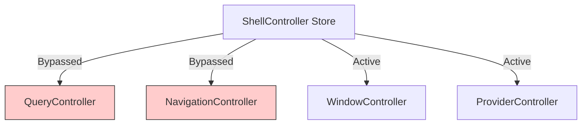

# Refactoring Roadmap

This document outlines the phased technical roadmap to clean up technical debt, improve architectural separation, and integrate half-implemented modules in the `@nuxy/core` package and `com.nuxy.shell` extension.

---

## Phase 1: Decoupling DOM Dependencies from `@nuxy/core`

### Objective
Ensure that `@nuxy/core` remains a pure, environment-agnostic TypeScript library. Background Worker threads spawned by the scanner run in standard Node.js environments and must not evaluate or import browser-specific classes (like `HTMLElement` or `Document`).

### Proposed Changes
- **Move UI Composition Types**: Extract the composition interfaces (`CoreComposition`, `NuxyToolElement`, `CompositionMountOptions`) out of `packages/core/src/composition.ts`.
- **Relocate to UI/Preload Layer**: Relocate these browser-centric definitions to a frontend-specific contract layer (such as the preload context files or a dedicated typings section in `@nuxy/ui`).
- **Clean up Lit Helper Exports**: Move `packages/core/src/lit.ts` re-exports entirely to the renderer compiler boundary, removing them from the core library index.

### Action Items
- [ ] Relocate DOM interface declarations out of [composition.ts](file:///home/xava/Documents/nuxy/packages/core/src/composition.ts).
- [ ] Refactor imports in [backend.ts](file:///home/xava/Documents/nuxy/extensions/shell/backend.ts) and other worker extensions to verify zero DOM namespace references.
- [ ] Remove [lit.ts](file:///home/xava/Documents/nuxy/packages/core/src/lit.ts) exports from `@nuxy/core`'s main entry point.

---

## Phase 2: Shell Controller Modularization & Integration

### Objective
Integrate the bypassed `QueryController` and `NavigationController` sub-modules into `ShellController` (`controller.ts`) to eliminate redundant states and shrink the 992-line main orchestrator.

### Proposed Changes
- **Delegate Query State**: Replace the store's raw `query` and `savedQuery` modifiers in `ShellController` with calls to [QueryController](file:///home/xava/Documents/nuxy/extensions/shell/controllers/query-controller.ts).
- **Delegate Selection Index State**: Bind the store's `selectedIndex` state to [NavigationController](file:///home/xava/Documents/nuxy/extensions/shell/controllers/navigation-controller.ts).
- **Consolidate Keyboard Navigation**: Map the arrow navigation hooks inside [KeyboardController](file:///home/xava/Documents/nuxy/extensions/shell/controllers/keyboard-controller.ts) to trigger the delegation methods on the navigation sub-controller.

### Action Items
- [ ] Import and instantiate `QueryController` inside `ShellController`.
- [ ] Import and instantiate `NavigationController` inside `ShellController`.
- [ ] Update [KeyboardController](file:///home/xava/Documents/nuxy/extensions/shell/controllers/keyboard-controller.ts) arrow handlers to call `navigation.moveUp()` and `navigation.moveDown()`.
- [ ] Verify functionality via [query-controller.test.ts](file:///home/xava/Documents/nuxy/extensions/shell/tests/query-controller.test.ts) and [navigation-controller.test.ts](file:///home/xava/Documents/nuxy/extensions/shell/tests/navigation-controller.test.ts).

---

## Phase 3: Settings & Theme Orchestration Consolidation

### Objective
Resolve the duplicate settings-application logic distributed across `InitController` and `SyncController` by centralizing DOM property modifiers into a dedicated module.

### Proposed Changes
- **Introduce `SettingsController` / `ThemeController`**: Extract theme styles loading, locale placeholders syncing, and user preferences application into a single, cohesive controller class.
- **Simplify `SyncController`**: Narrow the scope of [SyncController](file:///home/xava/Documents/nuxy/extensions/shell/controllers/sync-controller.ts) to handle only active portal boundaries and window bounds calculations.
- **Simplify `InitController`**: Narrow the scope of [InitController](file:///home/xava/Documents/nuxy/extensions/shell/controllers/init-controller.ts) to handle only backend data boots (tools, providers, histories).

### Action Items
- [ ] Create `SettingsController` inside `extensions/shell/controllers/`.
- [ ] Move `applySettingsToDOM` and `applyThemeByName` functions into this new controller.
- [ ] Refactor `InitController` and `SyncController` to remove overlapping DOM-updating hooks.

---

## Phase 4: IPC Mesage Type Safety & Reliability

### Objective
Increase the reliability of IPC message passes between background extension workers and the main Electron window process by adopting strictly-typed discriminated union schemas.

### Proposed Changes
- **Implement Discriminated Unions**: Define a strict union format on IPC message channels using a `kind` discriminator (e.g., `kind: 'call' | 'reply' | 'event'`).
- **Implement Call Timeouts**: Add a 30-second countdown check on host calls to reject promises and clean up listener memory leak sources.
- **Add Worker Error Handlers**: Register failed workers with the main process (`registry.markFailed(extId)`) and display error banners in the launcher UI rather than failing silently.

### Action Items
- [ ] Refactor [messages.ts](file:///home/xava/Documents/nuxy/packages/core/src/messages.ts) to declare strict typed message structures.
- [ ] Update preload channels to enforce payload structure validations.
- [ ] Integrate error bounds alerts inside `<nuxy-shell-view>`.
